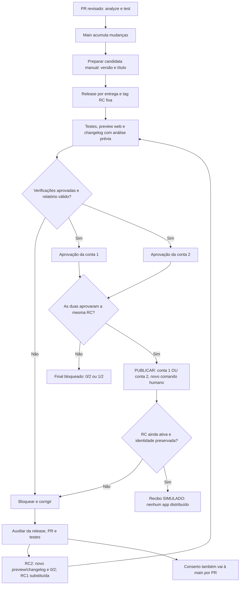

# Acordo de escopo preservado antes da implementação

Este documento registra o planejamento aprovado, incluindo pendências daquela fase. O estado operacional atual está em [Fluxo com dois aprovadores](FLUXO-DOIS-APROVADORES.md).

# Plano de ação — primeiro ensaio de entrega

**Próximo passo: implementar somente a Etapa 1, após conferir as decisões pendentes.** Este pedido entrega o plano e sua revisão crítica; não executa o ensaio.

Atualizado em 08/10/2026, Fortaleza. **Estado: planejamento da POC simplificada; novo fluxo ainda não implementado nem validado.** Este acordo substitui a proposta V4 para a futura POC: **sem beta, duas contas reais aprovam e qualquer uma das duas pode acionar PUBLICAR**. O plano anterior foi preservado no histórico V4 local, assim como código, pipelines e evidências existentes.

## O primeiro ensaio

1. PRs revisados entram na `main` e podem se acumular. Merge não cria candidata nem publica.
2. Israel escolhe **versão da entrega e título** em Preparar candidata, manualmente nas Actions. A automação resolve uma vez o commit escolhido pela regra de preparação; não pede SHA ou hash ao usuário.
3. A primeira candidata abre `release/1.4.0` a partir da main e cria a tag fixa `v1.4.0-rc.1`. Snapshot é a foto do código versionado, não um build.
4. Avaliar entrega executa verificações necessárias, prepara um **preview web real e estável** e apresenta changelog, link e classificação prévia por plataforma/base.
5. **Israel E Fabrícia** aprovam a mesma RC. A segunda aprovação apenas libera a próxima etapa.
6. **Israel OU Fabrícia** aciona PUBLICAR em uma etapa separada. O primeiro ensaio registra somente **decisão humana real e resultado SIMULADO**, sem distribuir o aplicativo.
7. Se mudar código, corrigir pela release, preparar RC2 e novo preview/changelog e obter novos avais. RC1 continua preservada e impedida de avançar.

Neste primeiro ensaio: uma candidata ativa, Flutter analyze/test e web. Sem builds Android/iOS, geração de patches Shorebird, lojas, publicador multidestino, urgência completa ou recuperação de publicação parcial. Esses itens continuam no backlog posterior; nenhuma implementação existente será apagada por esta revisão.

## Papéis são configuração, não nomes fixos na regra

Configuração lógica a aplicar no futuro; **não é um framework nem arquivo já implementado**:

| Papel | Configuração da POC | Migração para Amulets |
|---|---|---|
| Operador/preparador | Israel, `israelhudson` | Confirmar quem pode preparar/iniciar e reexecutar. |
| Aprovadores obrigatórios | Israel, `israelhudson`, **E** Fabrícia, `fahnassau30` | Samuel **E** Vinícius; confirmar logins/IDs. |
| Publicadores autorizados | `israelhudson` **OU** `fahnassau30`; inicialmente o mesmo conjunto dos aprovadores | Samuel **OU** Vinícius; confirmar mapeamento. |
| Revisor técnico do PR | Pessoa elegível designada por PR; ainda a confirmar | Ian/Yann é referência desse papel, não aprovador da versão por ser revisor técnico. |

O processo exige **todos os aprovadores obrigatórios**; o comando final pode ser dado por **qualquer publicador autorizado**, depois de todos os avais. O operador não recebe poder exclusivo para autorizar. Manter preparador, revisores da RC e pessoa que acionou PUBLICAR separados no registro, mesmo quando há sobreposição de papéis.

Isso substitui a simulação anterior em que Israel representava Samuel e Vinícius sozinho. **Agora as duas aprovações são de contas reais distintas; somente o resultado da publicação é simulado.** O LAB permite Israel preparar, aprovar e publicar; isso não comprova independência entre preparador e aprovador. A política da Amulets será confirmada na migração, sem presumir Israel ou Fabrícia como aprovadores.

## Três responsabilidades de workflow, a implementar

| Responsabilidade | Entrada e resultado propostos |
|---|---|
| **Verificar PR** | PR para main ou release: `flutter analyze` e `flutter test`; revisão técnica continua humana. |
| **Preparar candidata** | Manual, versão/título. Primeira RC resolve main; correção resolve a ponta revisada da release da mesma entrega. Cria branch quando necessária e tag RC imutável; registra identidade internamente. |
| **Avaliar entrega** | Testes necessários, build/reuso web verificado, changelog/classificação, dois jobs de aprovação obrigatórios e um terceiro job PUBLICAR. Resultado final SIMULADO no LAB. |

Na futura implementação, substituir as responsabilidades dos workflows antigos
por esse percurso e revisar os gatilhos para que caminhos antigos não executem
em paralelo. Preservar histórico e evidências. Esta revisão não apaga nem altera
os pipelines atuais; a substituição depende do próximo pedido de implementação.

Uma tag RC enviada por humano pode iniciar avaliação. Quando a tag é criada com `GITHUB_TOKEN`, o push não encadeia outro workflow: a preparação precisa chamar a avaliação reutilizável ou realizar dispatch explícito. Preferência para o primeiro incremento: chamada reutilizável; conservar um caminho de tag humana para a mesma lógica, sem duas avaliações efetivas da mesma RC. [Eventos do GITHUB_TOKEN](https://docs.github.com/en/actions/concepts/security/github_token), [workflows reutilizáveis](https://docs.github.com/en/actions/how-tos/reuse-automations/reuse-workflows).

O nome PUBLICAR identifica a etapa proposta; na interface nativa do Actions ela usa o gate de aprovação do job/environment. Não é um botão personalizado já implementado em GitHub Releases. Após 2/2, o terceiro job espera uma **nova ação humana**; não executa o resultado final automaticamente.

### Fluxograma do acordo atual

Na POC, conta 1 = Israel e conta 2 = Fabrícia. Na Amulets, os mesmos papéis são Samuel e Vinícius. O fluxograma não contém autorização final exclusiva de Israel nem uma terceira pessoa obrigatória.

## Identidade interna e experiência simples

O formulário futuro pede versão/título, não SHA/hash. A automação registra internamente tag, commit e árvore exatos, inputs, hash do preview/changelog/relatório, política, atores e RC ativa. Aprovação sempre se vincula a essa mesma identidade; simplificar a tela não remove rastreabilidade.

Resolver a referência uma única vez. Depois do corte, não consultar novamente main/latest para escolher o código avaliado. SHA é identificação do código, não compilação; não atribuir a ele a demora do build sem medir as etapas. O resumo principal mostra versão, título, RC, mudanças, preview, previsão e estado; dados técnicos permanecem consultáveis nos logs.

No ensaio, `1.4.0` é o exemplo de identificador da entrega. Registrar também a versão observada no pubspec, sem alterá-la automaticamente. Versão-base mobile é outra informação, por plataforma; a regra futura de versões/builds do aplicativo será decidida antes de distribuição real.

Preview web exige um build existente ou novo. Reaproveitar somente com equivalência demonstrada de código e entradas relevantes — SDK, dependências/lockfile, flags e configuração — e com bytes/link preservados. Sem essa prova, construir web. O link deve permanecer estável durante toda a avaliação. Trocar conteúdo ou preview avaliado exige nova RC/avaliação, sem transportar automaticamente os avais.

## Changelog: previsão antes, resultado depois

Antes dos avais, apresentar mudanças da entrega, preview e esta tabela por plataforma: **base alvo exata, classificação prévia, motivo e origem da evidência**. A comparação usa toda a candidata contra cada base mobile, incluindo alterações acumuladas/transitivas; o diff do último PR ou RC1 → RC2 é insuficiente.

| Exemplo didático | Classificação prévia | Motivo e limite |
|---|---|---|
| Android: base identificada; mudança só Dart, sem diferenças nativas/config/SDK ou assets empacotados não suportados | **Patch possível** | Previsão; ainda não gerou nem validou um patch. |
| iOS: mudança Swift/plugin nativo desde a base, ou alteração de SDK/configuração incompatível | **Loja / nova release nativa** | A alteração precisa entrar no novo pacote nativo; não seguir como patch desse alvo. |
| Base ausente, dependência transitiva desconhecida ou evidência insuficiente | **Inconclusivo — alvo bloqueado** | Não declarar patch possível nem habilitar publicação desse destino. |

Adicionar/alterar/remover assets empacotados não suportados também exige nova release. Usar no Dart um asset já presente na base não é alteração desse asset. Uma mudança de pacote Dart não implica loja automaticamente: conferir o conteúdo e as dependências transitivas; componentes Java/Kotlin/Swift, nativos, SDK e configuração precisam de avaliação própria. [FAQ Shorebird](https://docs.shorebird.dev/code-push/faq/), [referência 004](../../referencias/docs/004-shorebird-patch-e-elegibilidade.md).

A análise anterior aos avais é **prévia, sem compilar mobile agora**. No LAB podem ser usados casos e bases fictícias, sempre rotulados como simulação; eles não confirmam uma base ou compatibilidade real. Inconclusivo mantém o alvo bloqueado. Um recibo SIMULADO não remove esse bloqueio nem autoriza enviar o aplicativo.

No fluxo real futuro, gerar o patch Shorebird confirma tecnicamente a comparação com os artefatos da release-base. Incompatibilidade bloqueia o destino e exige decisão/reavaliação; não ignorar warnings nem transformar patch em loja silenciosamente. Cherry-pick é transporte de alterações no Git, não geração de patch Shorebird. [Guia de patches](https://docs.shorebird.dev/code-push/patch/).

Depois do comando, atualizar o registro com resultado por destino, distinguindo previsão de execução. No LAB: **decisão real de PUBLICAR registrada; resultado SIMULADO; patch não gerado; app não distribuído**. Futuramente: recibos reais e IDs retornados pelo provedor. Mudar conteúdo, rota, base ou alvos aprovados exige nova avaliação e autorizações pertinentes; os avais antigos não autorizam a mudança.

Changelog de produto e compatibilidade mobile têm bases diferentes. O primeiro incremento deve definir internamente sua base inicial de changelog e, depois, comparar com a última entrega encerrada nesse ensaio. Não chamar um resultado simulado ou GitHub Release de última produção mobile.

## Corrigir a candidata, preservar o histórico

1. Criar uma branch temporária a partir de `release/1.4.0`, aplicar o conserto e abrir PR de volta para essa release.
2. Após revisão, merge e testes, preparar `v1.4.0-rc.2` na **mesma branch de entrega**. RC1 não muda; sua avaliação é cancelada/encerrada e seu comando final fica inválido.
3. Preparar preview/changelog/classificação correspondentes e começar em 0/2. Aprovar RC2 nas duas contas e dar novo comando final.
4. Levar o conserto também à main por PR, resolvendo conflitos e testando com as funcionalidades que avançaram ali. Não puxar essas features para a release nem reescrever o histórico.
5. Numa promoção real futura, a tag final `v1.4.0` aponta ao mesmo commit aprovado da release, não ao merge posterior da main. Remover a branch somente após concluir a entrega e integrar todas as correções; preservar tags e registros.

Uma candidata ativa basta. Preparação de RC2 deve ser possível enquanto RC1 espera pessoas: serializar o corte/substituição, sem manter um bloqueio global de preparação por toda a espera de aprovação. Antes do recibo final, reconfirmar a RC ativa e os dois gates da identidade atual. Reexecução ou aprovação de um job antigo não ressuscita RC1.

## Estado observado e revisão crítica

Consulta somente em leitura em 08/10/2026:

| Item | Estado observado | Lacuna para o novo ensaio |
|---|---|---|
| Repositório | Público; Israel admin; Fabrícia `fahnassau30` com write | Write permite iniciar/reexecutar Actions; não significa que toda pessoa com write seja preparador autorizado. |
| `aprovacao-israel` | Revisor exclusivo Israel | Ligar o job correspondente à identidade fixa da RC. |
| `aprovacao-fahnassau30` | Revisora exclusiva Fabrícia | Ligar o segundo job obrigatório à mesma RC. |
| `autorizar-publicacao` | Revisor exclusivo Israel | **Precisa incluir Israel e Fabrícia na futura implementação**, para o OR desejado no terceiro job. Não foi alterado agora. |
| Os três ambientes | `prevent_self_review=false`, `can_admins_bypass=false`, sem restrição de ref | Sobreposição permitida no LAB; decidir/restringir refs confiáveis conforme os gatilhos escolhidos. |
| main e tags novas | Proteção de main ausente; ruleset RC cobre namespaces antigos, não `v*-rc.*` | Conferir/proteger PRs/checks de main/release e imutabilidade dos novos nomes antes do ensaio remoto. |
| Workflows e histórico | Pipelines/evidências anteriores preservados; preview e publicação GitHub-only já tiveram ensaios | Não há comprovação do novo encadeamento, gates nativos 2/2 ou resultado deste plano. Não contabilizar o gate antigo do proprietário como 2/2. |

**AND nos dois primeiros gates, OR somente no terceiro.** Um environment com várias pessoas aceita um dos revisores. Por isso, os dois primeiros jobs usam ambientes exclusivos e são obrigatórios; PUBLICAR depende do sucesso efetivo dos dois e usa o ambiente com ambos publicadores. Job ignorado, rejeitado ou cancelado não vale como aprovação. Variáveis de configuração não atualizam os reviewers reais; conferir o mapeamento antes do ensaio. [Regras de environments](https://docs.github.com/en/actions/reference/workflows-and-actions/deployments-and-environments).

**Iniciar não é aprovar nem publicar.** Definir quem pode preparar e reexecutar; a permissão write da plataforma é mais ampla que esse papel lógico. Nos gates, registrar a pessoa que aprovou, não inferir sua identidade de `github.actor`, que representa o iniciador do run. O terceiro gate registra quem acionou PUBLICAR; o preparador não precisa ser essa pessoa. [Execução manual](https://docs.github.com/en/actions/how-tos/manage-workflow-runs/manually-run-a-workflow), [identidades das execuções](https://docs.github.com/en/actions/reference/workflows-and-actions/variables), [histórico de aprovações](https://docs.github.com/en/rest/actions/workflow-runs#get-the-review-history-for-a-workflow-run).

**Autoaprovação tem escopo limitado.** Israel pode iniciar e aprovar seus environments nesse LAB; isso não autoriza aprovar o próprio PR. Falta designar revisor técnico elegível para os PRs de Israel; não atribuir Fabrícia automaticamente a esse papel. Nomes de ambientes devem vir de configuração revisada; ausência/divergência de proteção bloqueia, não cria um gate desprotegido. Administradores ainda controlam workflows/regras; o ensaio não é inviolável contra o administrador. [Reviews de PR](https://docs.github.com/en/pull-requests/how-tos/review-pull-requests/approving-a-pull-request-with-required-reviews).

**Limite na Amulets privada.** No GitHub Team, required reviewers de environment estão disponíveis apenas em repositórios públicos. A POC pública demonstra esse caminho público; antes de migrar para a Amulets privada, escolher disponibilidade/plano ou outro mecanismo que mantenha Samuel E Vinícius nos avais e Samuel OU Vinícius no comando final. Não basta trocar variáveis ou copiar os ambientes. Nenhuma mudança na Amulets faz parte deste pedido. [Disponibilidade por plano](https://docs.github.com/en/actions/reference/workflows-and-actions/deployments-and-environments).

## Incrementos pequenos e aceite

Todos abaixo permanecem **a implementar/ensaiar**; não são etapas concluídas por esta revisão.

| Etapa | Entrega | Critério de aceite e evidência |
|---|---|---|
| **1. Papéis e Verificar PR** | Mapeamento simples, revisor técnico, analyze/test e plano de substituição dos workflows antigos | Papéis/regras reais coincidem; PR com falha não pode entrar pelo percurso aprovado. Mapear/revisar gatilhos para o novo percurso sem disparos antigos em paralelo; preservar histórico/evidências. Registrar checks e revisão elegível. |
| **2. Preparar candidata** | Versão/título, release/tag e identidade interna | Não pede SHA/hash; corte único resolve main; mesma entrega usa a mesma release e nova RC. Tag imutável; uma avaliação efetiva por RC. Registrar refs e origem do disparo. |
| **3. Avaliar entrega** | Testes, preview web estável, changelog e classificação prévia | Web real abre; build só quando não há reuso equivalente. Bases/motivos/origem explícitos; fictício não vira evidência real. Falha técnica bloqueia. Registrar link, hashes internos e relatório. |
| **4. Dois avais e PUBLICAR** | Dois gates obrigatórios e terceiro gate OR | 0/2 e 1/2 bloqueiam; 2/2 apenas habilita novo comando; qualquer um dos dois pode comandar. Registrar dois usuários reais e publicador, com resultado SIMULADO. |
| **5. RC2 e conserto na main** | PR de correção, nova avaliação e retorno à main | RC1 preservada/substituída; RC2 em 0/2; features novas da main ausentes da release. Comando antigo falha sem recibo novo. Registrar PRs, refs e testes. |
| **6. Ensaio acompanhado por Israel** | Percorrer cenários do mínimo | Screenshots/logs demonstram preview real, aprovação de cada conta, comando separado e ausência de distribuição. Não usar sucesso histórico como execução deste ensaio. |

### Cenários negativos obrigatórios

- Analyze/test ou preview falha: não abrir o caminho final como se tivesse passado.
- Só Israel ou só Fabrícia aprova: PUBLICAR continua bloqueado; dois cliques da mesma conta não satisfazem 2/2.
- Segunda aprovação: libera o terceiro gate, sem gerar recibo final automaticamente.
- Rejeição, cancelamento ou job pulado: não contar como aprovação válida.
- RC2 preparada: RC1 não avança, mesmo com dois avais antigos; RC2 exige novos.
- Tag/hash/preview ou configuração de aprovadores diverge: bloquear, sem pedir ao usuário que copie hash para contornar.
- Base mobile desconhecida: inconclusivo/alvo bloqueado. Não rotular como patch possível nem usar uma base fictícia como real.
- Mudança nativa acumulada desde a base, mas último PR só Dart: não classificar olhando apenas o último diff.
- Asset já presente ou pacote somente Dart muda: analisar efeito real, sem bloqueio automático pela palavra asset/dependência.
- Incompatibilidade futura na geração: bloquear o destino; sem bypass, fallback silencioso para loja ou reaproveitar avais de outra rota.
- Quem tem write mas não é preparador: não ganha o papel de preparar só por poder abrir Actions. Um dos publicadores pode acionar o terceiro gate sem ter iniciado o run.

## O que ainda falta decidir antes de implementar

1. Revisor técnico dos PRs de Israel e controles de main/release; quem pode preparar/reexecutar além do operador indicado.
2. Mapeamento/proteção dos ambientes e refs. O ambiente final deve admitir os dois publicadores; os dois primeiros continuam exclusivos.
3. Registro mínimo da RC ativa e encerramento/cancelamento da anterior; encadeamento reutilizável/dispatch sem duplicação.
4. Base inicial do changelog, retenção do preview e fonte das bases/evidências da classificação. Casos fictícios ficam declarados; sem base real não prometer destino mobile habilitado.
5. Antes da Amulets: confirmar logins, operador/revisor técnico e conjunto de publicadores; resolver o gate para repositório privado Team.

## Backlog posterior, fora do primeiro incremento

- Builds/instalação Android e iOS, bases concretas e patches Shorebird; caminho explícito de loja e assinatura.
- Publicador real por destino, resultados/recibos/adoção e tags de sucesso no commit aprovado.
- Falha parcial, timeout, reconciliação completa e retry idempotente entre serviços.
- Fila ampliada e urgência a partir do que foi realmente publicado; retomada da entrega pendente.
- Slack e integrações extras; configuração mais abrangente somente se o uso justificar.
- Migração/revisão específica da Amulets com políticas reais de acesso e aprovação.

Essas capacidades e lições existentes foram preservadas, mas não são dependências obrigatórias do ensaio mínimo. Consultas históricas: histórico V4 local, acordo V4 histórico, [lições/evidências anteriores](https://github.com/israelhudson/flutter_code_push_example/blob/05634b4b620cc30a053e5acab5fefb0667f2544e/docs/delivery/LICOES-APRENDIDAS.md) e [passo a passo GitHub-only](https://github.com/israelhudson/flutter_code_push_example/blob/05634b4b620cc30a053e5acab5fefb0667f2544e/docs/delivery/PASSO-A-PASSO-PROMOCAO.md).

## O que significa o resultado

| Resultado | O que comprova |
|---|---|
| Preview web real | Avaliação web daqueles bytes; não patch ou app nativo. |
| Dois avais reais + PUBLICAR no LAB | Aprovação das duas contas e comando separado; recibo SIMULADO, `distribution_performed=false`. |
| GitHub Release | Registro de versão/notas/assets; não prova essas aprovações nem distribuição do aplicativo. O novo ensaio não a cria para simular sucesso. |
| Entrega real futura | Resultado confirmado por destino e observado conforme o critério de validação; ainda fora deste incremento. |

## Registro desta revisão

Em 08/10/2026, o plano V4 foi preservado e o acordo simplificado foi escrito após revisão das instruções, referências e APIs públicas/oficiais. Repositório, colaboradora, ambientes, proteção de main e rulesets foram consultados somente em leitura. A correção final de papéis foi incorporada: ambos aprovam, qualquer um publica; não existe autorização exclusiva do operador. Classificação prévia e resultado posterior permanecem distintos.

Nenhum pipeline foi apagado, implementado ou disparado; nenhum ambiente foi alterado, nenhuma publicação/commit/push foi realizada. Implementação e ensaios dependem do próximo pedido. No ensaio planejado, PUBLICAR pode ser acionado por Israel ou Fabrícia, conforme a política. Este documento não afirma que a nova interface ou o ensaio 2/2 já existam.
