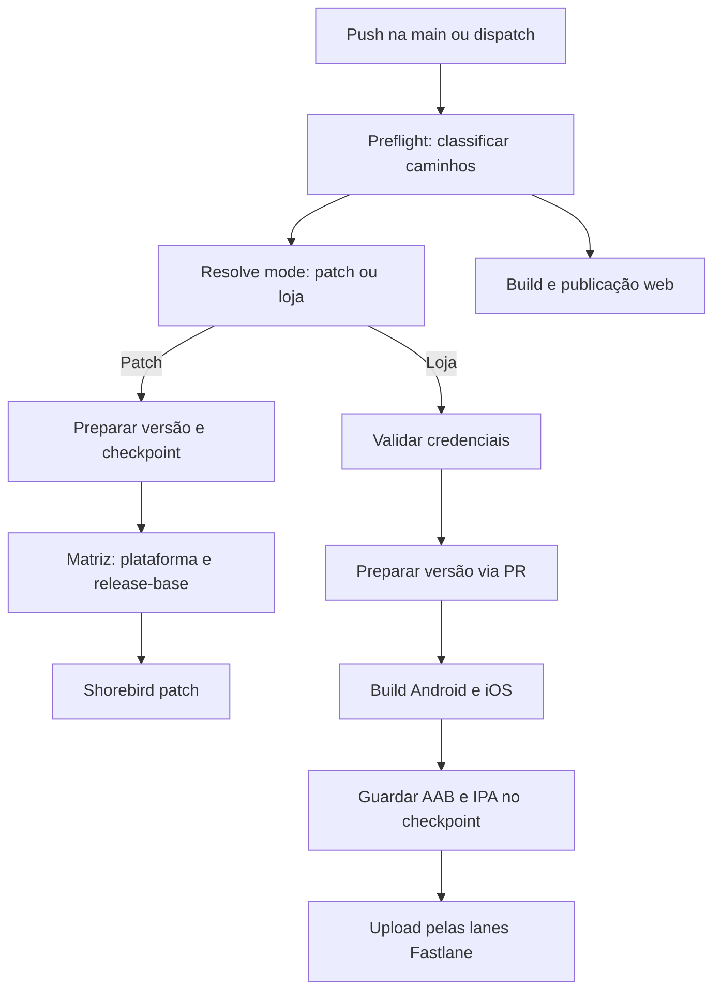
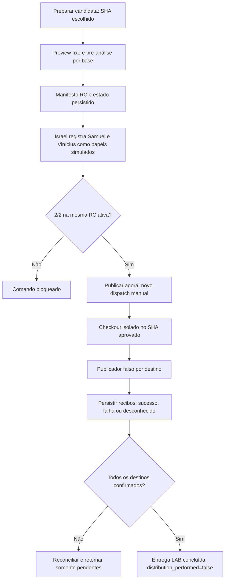

# Actions da POC: estrutura inspirada no Amulets

**Próximo passo: tornar o laboratório persistente no GitHub e executar uma entrega
completa com publicadores falsos.** Israel opera tudo, com os papéis registrados
como simulação. A publicação real de um aplicativo continua sendo uma etapa
posterior, com autorização específica e configuração própria deste projeto.

Leitura: cerca de 6 minutos. O documento distingue o código lido no Amulets,
os contratos escolhidos para a POC e a implementação inicial abaixo.

## Fonte verificada em 07/10/2026

A leitura do Amulets ocorreu em `main`, no commit
`f8c8b40d50562465242322afd33caa2a5212718c`. O checkout tinha uma alteração local
em `ios/Runner.xcodeproj/project.xcworkspace/xcshareddata/swiftpm/Package.resolved`,
preservada. Nenhum comando de build, Shorebird, Fastlane ou CI foi executado lá.

A POC foi examinada em `codex/github-release-approval-poc`, no commit
`9c8b90e2a9b1674a24670ccdd183a796c7fad5bd`, antes da criação deste documento.

| Fonte atual | O que o código mostra |
|---|---|
| [AGENTS do Amulets](/Users/israelhudson/dev/dev-projects/dev-jobs/amulets-mobile/AGENTS.md) | Automação de deploy em `deploy/*.dart`, releases-base explícitas e credenciais fornecidas pelo CI. |
| [deploy-main.yaml](/Users/israelhudson/dev/dev-projects/dev-jobs/amulets-mobile/.github/workflows/deploy-main.yaml:1) | Dispara em push na main ou manualmente; separa classificação, decisão, patch, preparação de release, builds, uploads e web. |
| [change-impact.yaml](/Users/israelhudson/dev/dev-projects/dev-jobs/amulets-mobile/.github/workflows/change-impact.yaml:1) | Workflow reutilizável que recebe base/head e expõe a classificação para os outros jobs. |
| [change_impact.dart](/Users/israelhudson/dev/dev-projects/dev-jobs/amulets-mobile/deploy/change_impact.dart:1) | Classificação estática de caminhos; mudanças nativas, assets, dependências, SDK e arquivos desconhecidos indicam loja. |
| [shorebird_patches.dart](/Users/israelhudson/dev/dev-projects/dev-jobs/amulets-mobile/deploy/shorebird_patches.dart:1) | Manifesto com plataforma e releaseVersion; permite validação, matriz, patch e dry-run. O dry-run distingue incompatibilidade de falha operacional. |
| [pull-request.yaml](/Users/israelhudson/dev/dev-projects/dev-jobs/amulets-mobile/.github/workflows/pull-request.yaml:1) | Testes e lint precedem o build web; um job separado publica o preview e outro o remove no fechamento do PR. |
| [Fastfile](/Users/israelhudson/dev/dev-projects/dev-jobs/amulets-mobile/fastlane/Fastfile:1) | Upload de AAB para Google Play internal e de IPA para TestFlight. |
| [Makefile](/Users/israelhudson/dev/dev-projects/dev-jobs/amulets-mobile/Makefile:1) | Entradas de release, patch e web; algumas executam publicação real. |

Os manifestos Shorebird e a configuração de flavors foram lidos com IDs
omitidos. `shorebird-patches.json` tem dois destinos mobile e versões-base
explícitas. Isso não comprova, por si só, a existência ou compatibilidade dessas
bases no serviço. Nenhum ID de aplicativo, projeto cloud ou credencial do Amulets
foi copiado para a POC.

Há uma divergência de versão na documentação interna: o AGENTS menciona um SDK
Flutter mais antigo; a `.fvmrc` atual informa `3.44.1`. A implementação da POC
deve usar seus próprios inputs fixados, sem herdar esse número automaticamente.

## Como a Action mobile está organizada hoje

O caminho patch usa `fail-fast: false`, permitindo resultados diferentes por
plataforma. O caminho loja separa criação da base Shorebird e envio à loja;
preserva os binários em um checkpoint de GitHub Release para retomada.
Se uma base já estiver ativa mas o checkpoint do binário estiver ausente,
o código bloqueia uma republicação automática da mesma versão.

No `resolve_mode` atual, a decisão é estática. O helper oferece um dry-run
Shorebird, mas esse job não o executa. A análise de caminhos não substitui a
comparação do build com os artefatos da release-base.

## O que adaptar para esta POC

| Estrutura aproveitável | Contrato da POC |
|---|---|
| Preflight reutilizável | Pré-analisar **cada plataforma contra sua própria release-base exata**. Emitir `patch_previsto`, `loja_necessaria` ou `pendente`. |
| Matriz de destinos | Registrar Android, iOS e web separadamente, com entradas de build e chave de operação por destino. |
| Separar preparação e publicação | Preparar candidata é manual; 2/2 libera o comando **Publicar agora**, sem executá-lo. |
| Versão e checkpoint persistentes | Guardar manifesto, eventos, estado e recibos entre runs; usar hash e revisão do estado para detectar conflitos. |
| Recuperar binário antes de reconstruir | Recuperar resultado confirmado por chave de operação; consultar o provedor antes de repetir uma tentativa incerta. |
| Credenciais fora do repositório | Futuros adaptadores usam somente credenciais próprias desta POC, liberadas no job de publicação autorizado. |
| Jobs e runners por plataforma | O publicador falso usa Ubuntu. O build de laboratório usa Ubuntu para AAB e macOS para XCArchive sem assinatura. |

Algumas decisões diferem do Amulets atual:

1. **Merge de PR não gera RC nem publica.** Um lote é escolhido no dispatch.
2. **A pré-análise não muda automaticamente para loja.** Incompatibilidade ou
   evidência ausente bloqueia o patch e pede uma candidata com destino adequado.
3. **Todo job que usa o código da entrega recebe o SHA aprovado.** Vários jobs
   de preparação/build do Amulets usam `ref: main`; a POC publica a foto fixa
   da candidata, mesmo que a main tenha avançado.
4. **Versionamento que altera arquivos vem antes das aprovações.** Não executar
   bump de versão depois de aprovar o manifesto, pois isso cria outra foto.
5. **MVP sem TestFlight, Play internal ou track beta.** A estrutura de jobs pode
   ser equivalente usando resultados falsos e previews web reais.

## Estrutura operacional proposta

Manter os workflows existentes e acrescentar uma coordenação remota do LAB:

| Arquivo / componente | Responsabilidade |
|---|---|
| `deploy-main.yaml` — coordenação | Dispatch de comandos do laboratório: iniciar, preparar, aprovar papel, revogar, consultar, publicar dry-run, reconciliar e avançar fila. Um coordenador persiste o estado entre runs. |
| `delivery-preview.yml` | Testar, analisar e construir preview web do SHA escolhido; fornecer ZIP e metadata fixos. Reutilizar somente com equivalência de conteúdo e inputs. |
| `pull-request.yaml` | CI reutilizável chamado pelo job `policy` do preview: executa uma vez os testes Python e exemplos de 0/2, 1/2 e 2/2. As verificações Flutter continuam no job de preview. |
| `mobile-build.yaml` | Build reutilizável por plataforma, chamado com SHA completo. Gera AAB ou XCArchive sem assinatura e metadata; nenhuma distribuição. |
| `.github/actions/setup-flutter/action.yml` | Instala o SDK oficial e confere versão e revisão contra os inputs do snapshot. |
| `tools/delivery/lab_engine.py` | Continua sendo a única política de fila, aprovações, obsolescência, urgência e publicação parcial. Os workflows chamam o núcleo, em vez de reescrever essas regras em YAML. |
| `tools/delivery/snapshots.py` | Confere SHA/tree, preview, base por plataforma e checkout isolado. |
| `tools/delivery/remote_state.py` | Transporta banco, eventos e recibos pela branch de dados `codex/delivery-state`, conferindo a revisão anterior antes de escrever. |
| `slack_notify.py` | Avisos opcionais e links. Uma falha de aviso não muda o gate nem repete publicação. |

O caminho `delivery-candidate.yml` + `delivery-approval.yml` continua sendo o
caminho de reviews GitHub reais. A implementação operacional do LAB não converte
os papéis simulados em reviews de Samuel ou Vinícius e não relaxa aquele gate.

## Contratos mínimos para repartir a implementação

**Candidata imutável:** `candidate_id`, `delivery_id`, `tag`, `source_sha`,
`source_tree`, `manifest_hash`, preview e sua expiração, changelog e baseline
da última entrega concluída. Cada destino mobile informa versão/build da base,
SHA da base e inputs do build. Números de patches permanecem **a gerar**.

**Identidade dos eventos:** obter o operador do contexto autenticado do GitHub,
exigir Israel no LAB e registrar `actor=israelhudson`, papel escolhido,
`simulation=true`, ID da execução e chave estável do comando. Um campo enviado
pelo formulário não pode substituir a identidade autenticada do operador.

**Persistência:** usar a branch de dados separada `codex/delivery-state`,
com revisionamento do banco/eventos/recibos. Um único
coordenador escreve o estado, sob a mesma chave de concorrência de todos os
comandos. A atualização precisa conferir a revisão anterior e falhar em conflito.
Persistir a intenção antes de uma operação externa e o recibo depois dela.
Upload de artifact efêmero e `concurrency` sozinhos não implementam essa garantia.

O manifesto contém `repository_path` absoluto. Nos comandos LAB, o coordenador
usa caminhos Linux constantes: `/tmp/flutter-code-push-lab/repository` para o
checkout e `/tmp/flutter-code-push-lab/state` para o estado. Assim, a retomada
recria o mesmo vínculo local sem alterar o hash aprovado. Os jobs de build mobile
usam outro checkout isolado e recebem o SHA explicitamente; não reaproveitam
aprovações para um manifesto reconstruído com caminho diferente.

**Publicador por destino:** receber `operation_key`, destino, manifesto e checkout
verificado. Devolver recibo com SHA, hash do manifesto, resultado, identificação
do provedor e `distribution_performed`. Enquanto o backend é falso, manter
`simulation=true` e `distribution_performed=false`, inclusive nos recibos.

**Recuperação:** `desconhecido` não significa fracasso comprovado. Consultar o
provedor pela mesma chave antes de repetir; destino confirmado não roda novamente.
Um coordenador consolida os resultados. Workers por plataforma não sobrescrevem
independentemente o banco global. Na primeira versão, usar execução serial por
destino com o núcleo atual; paralelismo pode ser acrescentado depois do contrato
de consolidação estar testado.

**Urgência:** bloquear a candidata antiga, partir da última produção confirmada,
validar/aprovar/publicar a urgente, incorporar o conserto e retomar por nova RC.
Se houver publicação parcial, reconciliar os destinos antes de iniciar outra.

## Limite entre snapshot, preview e publicação

`B → RC1` fixa a foto completa dos arquivos versionados. A release nasce em B.
Se a main avança para C/D e a correção na release cria F′, `F′ → RC2` contém
B + correção; C/D não entram automaticamente. Branch avança, tags permanecem
fixas. RC2 exige novo preview, changelog e aprovações.

O preview é **web**. Não representa AAB, IPA ou patch já construído/testado.
Um futuro adaptador Shorebird só pode gerar o patch após os avais e o comando
final, usando o código aprovado e a release-base exata. A comparação final
precisa bloquear incompatibilidade, sem ignorar warnings nem escolher loja
automaticamente. Essa regra segue a [referência do projeto](../../referencias/docs/004-shorebird-patch-e-elegibilidade.md)
e o [guia oficial de patch](https://docs.shorebird.dev/code-push/patch/).

Criar uma base no Shorebird também é uma operação externa. O [guia de release](https://docs.shorebird.dev/code-push/release/)
distingue a criação/upload da base e o envio do binário à loja. Esses resultados
devem ter recibos separados; um não comprova o outro.

## Implementação inicial dos builds

`mobile-build.yaml` recebe `source_sha` completo e `platform=android|ios`.
As ferramentas são lidas do commit fixo do caller manual na main (`github.sha`)
e a aplicação é obtida no SHA informado, com
permissão de leitura e sem credenciais Git persistidas. O helper confere
HEAD/tree, arquivos rastreados e a versão/revisão Flutter antes de compilar.

O artifact tem nome `mobile-<platform>-<sha>`, contém `mobile.zip` e
`metadata.json`, com SHA-256, SHA da aplicação, SHA das ferramentas e tipo
explícitos. Android produz AAB de
laboratório, sem atestar assinatura para a loja. iOS usa
`flutter build ipa --release --no-codesign`, que no SDK fixado pula a exportação
IPA e retorna um **XCArchive sem assinatura**. Isso foi conferido no
[código do Flutter na revisão fixada](https://github.com/flutter/flutter/blob/924134a44c189315be2148659913dda1671cbe99/packages/flutter_tools/lib/src/commands/build_ios.dart#L475).

Os onze testes do helper usam compiladores e artefatos simulados para verificar
identidade, toolchain, bloqueios e empacotamento. Não comprovam um build nativo
executado no GitHub. A metadata declara `distribution_performed=false` e
`patch_compatibility_validated=false`; o build não chama Shorebird, Fastlane,
Play ou TestFlight. O CI reutilizável foi conectado ao preview existente sem
duplicar os testes Python nem mudar a busca dos artifacts web.

## Critérios antes de chamar esta esteira de operacional

- [ ] Estado de uma execução reaparece na seguinte sem resetar produção ou aprovações.
- [ ] 0/2 e 1/2 bloqueiam; 2/2 apenas libera o dispatch final.
- [ ] Eventos registram Israel real e papel simulado; nada aparece como review real.
- [ ] RC2 invalida os avais anteriores; C/D não vazam à release F′.
- [ ] Toda publicação usa SHA/tree/hash aprovados, nunca a ponta mutável da main.
- [ ] Loja necessária/pendente bloqueia patch; preview web não altera essa conclusão.
- [ ] Sucesso parcial fica parcial; retomada não repete o destino confirmado.
- [ ] Falha após efeito externo exige reconciliação antes de repetir.
- [ ] Uma RC ativa e fila serial sobrevivem entre runs; urgência foi ensaiada.
- [ ] Aviso Slack usa somente o canal privado autorizado e não interfere no gate.
- [ ] Fonte, artefatos e recibos indicam laboratório e ausência de distribuição real.

Persistência e dispatch estão implementados; a instalação do bot e a validação
real dos runs são registradas separadamente. Consulte [Operação no GitHub](OPERACAO-GITHUB.md).

**Próximo passo concreto:** executar uma candidata do começo ao fim em runs separados. Somente após
esse ensaio decidir o contrato e a autorização de um adaptador mobile real da POC.
