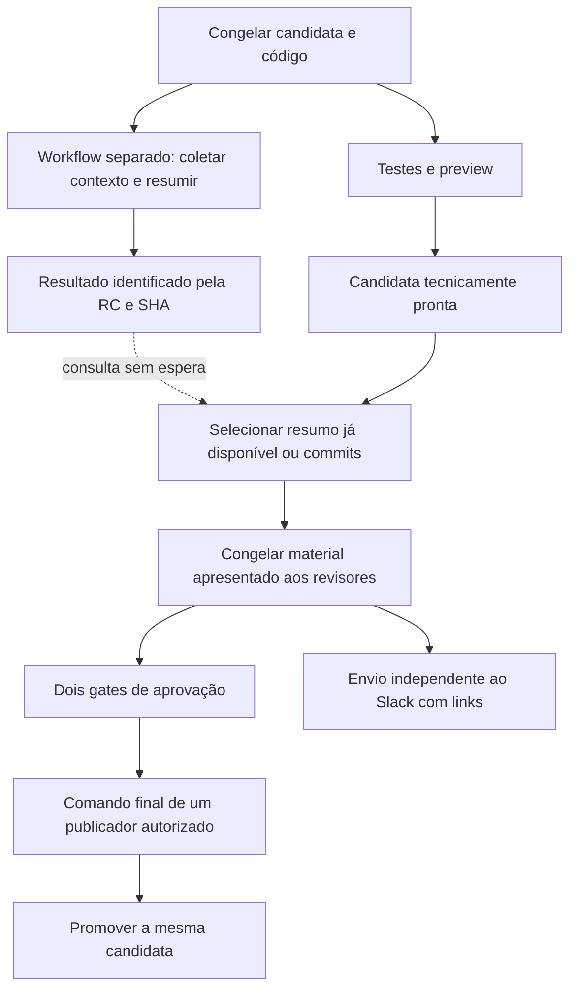

# Changelog semitécnico e avisos da candidata no Slack

Registro atualizado em 08/10/2026, Fortaleza, após a entrega do tema escuro.
**Comunicação congelada e fallback já estão integrados; o bot Slack tem prova
de conexão real. Os avisos automáticos integrados no PR #19 foram comprovados
nas jornadas 1.7.0 e 1.8.0: três RCs, duas estáveis e 13 avisos reais.
A rejeição da RC1 de 1.8.0 precisou de cancelamento operacional; sua história
permanece. O provedor de IA permanece inativo.**

A [PR #18](https://github.com/israelhudson/flutter_code_push_example/pull/18)
integrou os ajustes de estados, versões e comunicação. O
[teste isolado do Slack](https://github.com/israelhudson/flutter_code_push_example/actions/runs/37869235129)
comprova credencial, destino e envio real; o
[manual de operação](SLACK-AUTOMATICO.md) distingue essa prova da automação da
candidata. As seções sobre Copilot e Plane abaixo continuam como proposta de
adaptação, sem consumo de IA ou ativação de acesso ao Plane.

O [manual](SLACK-AUTOMATICO.md) registra os runs, cinco avisos da 1.7.0,
rejeição real da 1.8.0 e o incidente do outro gate ainda esperando. Encerramento
automático e leitura curta de `sent` concorrente foram integrados pela PR #21;
o novo fecho não tem prova negativa real. A RC2 foi promovida e a correção
voltou à main pela PR #22. Preservar texto/recibos históricos e mostrar o
estado atual observado separadamente.

Na RC2, as seções dos PRs #20/#21 somaram 1486 caracteres, acima do limite
agregado de 1400. O relatório escolheu `commits_fallback`, sem IA, e foi
preservado. Uma alteração do limite ou da forma de resumo vale para próximas
candidatas, antes dos avais; não substitui a comunicação já revisada.

## Tags: preservar a candidata após a promoção

Recomendação para este processo: manter as tags RC, inclusive as rejeitadas ou substituídas. Elas identificam o código avaliado e permitem relacionar logs, previews, decisões e correções. A promoção cria outra tag estável, preservando a candidata; não consiste em renomear uma tag.

Na consulta desta rodada, `v1.6.0-rc.1` e `v1.6.0` apontam ao mesmo commit `1cb8f3ef72a0d21c11cfa3b2c0d51f7c8c769935`. A [execução 37863610149](https://github.com/israelhudson/flutter_code_push_example/actions/runs/37863610149) terminou com sucesso e a [Release v1.6.0](https://github.com/israelhudson/flutter_code_push_example/releases/tag/v1.6.0) foi publicada às 21:25:49 de 08/10/2026, Fortaleza. É uma Release GitHub do laboratório; não comprova distribuição do app.

Se o histórico visual ficar extenso, separar versões estáveis de candidatas na apresentação, mantendo as refs originais. Uma tag RC não exige uma GitHub Release própria. A recomendação de retenção das RCs é uma decisão de rastreabilidade deste processo, não uma obrigação expressa do SemVer. O [SemVer](https://semver.org/) estabelece que o conteúdo de uma versão já publicada não deve ser alterado; a [documentação de releases imutáveis do GitHub](https://docs.github.com/en/code-security/concepts/supply-chain-security/immutable-releases) explica a proteção de tags/artefatos quando essa funcionalidade é ativada. Não presumir que toda tag Git seja imutável por padrão.

## Conteúdo para pessoas técnicas e não técnicas

Preservar dois níveis de leitura vinculados à mesma candidata:

- **Resumo semitécnico:** o que mudou para quem usa o app, como verificar e limitações relevantes. Linguagem simples, sem nomes de classes, merges ou hashes como texto principal.
- **Registro técnico:** base publicada, commits, PRs, SHA, manifesto, resultados e logs. Permanece disponível para investigação e como fallback.

Exemplo escrito manualmente a partir da entrega desta rodada; não é uma saída de IA:

> Candidata 1.6.0 — Tema claro e escuro
>
> Agora é possível alternar entre tema claro e escuro pelo botão no topo do aplicativo. Ao reiniciar, ele volta ao tema claro. A escolha não é salva e não acompanha o tema do sistema.
>
> Para validar: alterne os temas e reinicie o aplicativo.
>
> Aprovações: Israel e Fabrícia. Depois das duas aprovações, qualquer um dos dois pode autorizar a publicação no GitHub.
>
> Links: preview, changelog completo e execução para revisar/aprovar.

Na Amulets, a proposta correspondente usa Samuel **E** Vinícius para aprovar; Samuel **OU** Vinícius dá o comando final. Contas, ambientes e permissões precisam ser definidos na adaptação. Slack envia avisos e links; as decisões continuam autenticadas no GitHub.

## Fontes do resumo

1. Descrições das PRs que efetivamente integram o snapshot da RC, desde a base publicada. Incentivar uma seção “O que muda para o usuário / Como validar” no template da PR.
2. Quando houver task vinculada do Plane e acesso configurado para esse fim, coletar o contexto relevante para a comunicação. Associar a task à mudança presente no snapshot; uma task concluída isoladamente não prova inclusão na entrega.
3. Histórico de commits e diff do mesmo intervalo, preservados como evidência. Backports equivalentes e títulos de merge não devem ser anunciados como funcionalidades novas sem conferir o diff.

Salvar o texto utilizado, URLs/IDs, instante da coleta e hash da entrada. PRs e tasks podem ser editadas depois: a IA trabalha com a cópia coletada para aquela RC, não com descrições que mudam durante a aprovação. Fonte ausente, descrição vazia ou erro do Plane não bloqueia o corte. Não inventar funcionalidades a partir de um título; usar apenas o histórico de commits se não houver contexto suficiente.

## Processamento independente: IA não é dependência da entrega

Não existe seta de dependência entre `Resultado` e `Pronta`/`Gates`/`Promocao`. A seleção consulta somente um resultado já concluído; não espera a IA. O timeout do resumo também não deve ser somado ao tempo de preparação da candidata.

Contrato proposto:

- Iniciar o workflow auxiliar depois de registrar a identidade da RC, em paralelo com testes/build/preview. Não configurar `needs` do caminho obrigatório apontando para o job de IA. Um simples `continue-on-error` não basta: uma dependência desse job ainda faria o restante esperar.
- Falha ao disparar esse workflow também é opcional: registrar o erro e seguir com commits, sem falhar a preparação nem aguardar repetidas tentativas de dispatch.
- Limitar a concorrência e o consumo de runners do resumidor. Separar o workflow remove a dependência lógica; a configuração de capacidade também precisa evitar que os jobs opcionais ocupem todos os runners da entrega.
- Usar timeout e entradas limitadas; ausência de crédito, política desabilitada, erro, contexto insuficiente ou resultado indisponível na abertura da revisão usa **histórico de commits**. Registrar o motivo do fallback.
- Ao abrir a revisão, escolher o resumo disponível e validado ou os commits. Congelar a versão escolhida com seu hash no pacote que os dois revisores leem. A IA não pode alterar SHA, testes, classificação mobile, destinos ou decisões de autorização.
- Resultado que chega depois fica no log como `late_result`; não substitui silenciosamente o texto em revisão ou aprovado. Uma mudança material no conteúdo aprovado segue a regra de nova candidata e novos avais.
- Disparar o aviso do Slack de modo independente. Falha ou demora do Slack não segura testes, abertura de gates ou promoção; registrar aviso opcional, preservar a outbox e o recibo. Um envio confirmado é reaproveitado. Resultado incerto fica `unknown`: consultar o histórico e só marcá-lo `sent` com prova positiva, sem reenviar automaticamente. Não prometer entrega exatamente uma vez.

O disparo do workflow auxiliar deve usar um evento explícito após o registro da candidata, sem depender apenas do push de uma tag criada por `GITHUB_TOKEN`. Esse token não dispara a maioria dos outros eventos de workflow; `workflow_dispatch` e `repository_dispatch` são exceções documentadas. Usar apenas as permissões necessárias para o disparo auxiliar. [Documentação oficial](https://docs.github.com/en/actions/how-tos/write-workflows/choose-when-workflows-run/trigger-a-workflow).

## Copilot e disponibilidade

Opção a avaliar na implementação: **Copilot CLI em Actions**, com acesso e créditos disponíveis. A documentação atual permite `GITHUB_TOKEN` e `copilot-requests: write`; repositório pessoal debita o proprietário e organização depende da política e orçamento da organização. O modo programático executa sem uma sessão de chat interativa. Conferir o plano, as políticas, o modelo e o orçamento antes de ativar; esta proposta não confirma saldo, não habilita cobrança adicional e não consome créditos.

Rodar com contexto de leitura previamente coletado, sem ferramentas para aprovar, editar a candidata ou publicar. Fixar versões das ferramentas/prompt e validar a estrutura da saída antes de incorporá-la. Não prometer custo zero ou uma quantidade fixa de créditos por resumo.

A documentação do GitHub recomenda avaliar **GitHub Agentic Workflows** para executar a automação Copilot com controles próprios desse ambiente. Essa escolha de implementação deve manter as mesmas restrições de leitura e ausência de dependência da esteira principal.

Fontes oficiais consultadas:

- [Copilot CLI em Actions: configuração](https://docs.github.com/en/copilot/how-tos/copilot-cli/use-copilot-cli-in-actions).
- [Autenticação, políticas e cobrança](https://docs.github.com/en/copilot/concepts/agents/copilot-cli/copilot-cli-in-github-actions).
- [Modo programático e automação](https://docs.github.com/en/copilot/how-tos/copilot-cli/automate-copilot-cli/automate-with-actions).
- [Action oficial de inferência, atualmente Copilot-only](https://github.com/actions/ai-inference).

GitHub Models não é alternativa atual: a [documentação oficial](https://docs.github.com/en/github-models) registra sua retirada em 30/07/2026. “Generate release notes” do GitHub organiza PRs, colaboradores e comparações; não é uma garantia de resumo semitécnico por IA. [Notas automáticas](https://docs.github.com/en/repositories/releasing-projects-on-github/automatically-generated-release-notes).

## Avisos no Slack

Cada mensagem informa candidata/versão, estado atual, conteúdo semitécnico ou fallback identificado, preview, registro completo e **link da execução com os gates**. Link do preview não é link para aprovar.

| Estado | Texto essencial | Próxima ação |
| --- | --- | --- |
| Candidata pronta, 0/2 | Aguardando as duas aprovações | Abrir preview/changelog e revisar no GitHub |
| 1/2 | Uma aprovação registrada; falta o outro revisor | Segundo revisor decide no próprio gate |
| 2/2 | Duas aprovações; aguardando autorização final | Qualquer um dos publicadores dá o comando separado |
| Publicação iniciada | Comando recebido; resultado ainda em conferência | Aguardar confirmação dos destinos |
| Publicada | Resultado confirmado e links da versão/recibo | Consultar versão e evidências |
| Rejeitada ou substituída | Candidata encerrada; seu link não autoriza outra RC | Seguir a nova candidata, se houver |

Os estados vêm do journal e das decisões reais, nunca da IA. A tabela define o
contrato de comunicação; a cobertura efetivamente automatizada e seus ensaios
estão no [manual de operação](SLACK-AUTOMATICO.md). No LAB, o bot
`Flutter Deploy LAB` já foi validado no canal privado `app-deploy-test-isr`;
usar o [app e secret existentes](CONFIGURAR-SLACK-LAB.md). O canal e o app da
Amulets devem ser acordados com o time. A credencial do Slack e o acesso do
resumidor são dependências distintas e precisam de validação própria.

## Cenários para a próxima rodada

| Cenário | Resultado esperado |
| --- | --- |
| Resumo pronto antes da revisão | Texto semitécnico selecionado, vinculado à RC e às fontes; commits acessíveis |
| IA excede o prazo ou ainda está rodando | Aviso com commits; gates abrem sem esperar |
| Sem créditos/acesso, erro da IA ou saída inválida | Mesmo fallback, motivo registrado; entrega continua |
| Dispatch do resumidor falha por permissão/política/token | Registrar fallback; não falhar nem atrasar a preparação |
| PR vazia, task ausente ou Plane indisponível | Usar contexto disponível ou commits, sem inventar mudanças |
| PR/task é editada depois da coleta | Preservar a cópia e o hash escolhidos; não trocar a entrada durante a revisão |
| Resumo tardio depois da primeira aprovação | Não substituir o material apresentado nem modificar seu hash |
| Resultado de RC1 chega após criação de RC2 | Não anexar à RC2; verificar candidata, SHA e hashes antes de selecionar |
| Uma aprovação, depois duas | Slack mostra 1/2 bloqueado; 2/2 habilita somente o comando final |
| Slack falha ou demora | Gates/publicação seguem; outbox registra o estado e `unknown` exige prova positiva antes de marcar enviado |
| Backport já presente na versão anterior | Resumo não anuncia a mesma correção como mudança nova |

Guardar RC/SHA/base, hash das entradas e do material selecionado, fontes, prompt/modelo/provedor, início/fim, duração, estado do resumo, motivo do fallback, IDs dos avisos e confirmação de envio. Separar falha opcional de comunicação de falha real da publicação.

Antes de adaptar à Amulets: definir com Samuel acesso/créditos do Copilot,
canal/app Slack, fontes permitidas do Plane, orçamento/timeout e quem pode
preparar a RC. O LAB usa contexto explícito de PR quando disponível e commits
como fallback; não tem provedor de IA ativo. Preservar a regra de dois avais
mais comando final separado.
