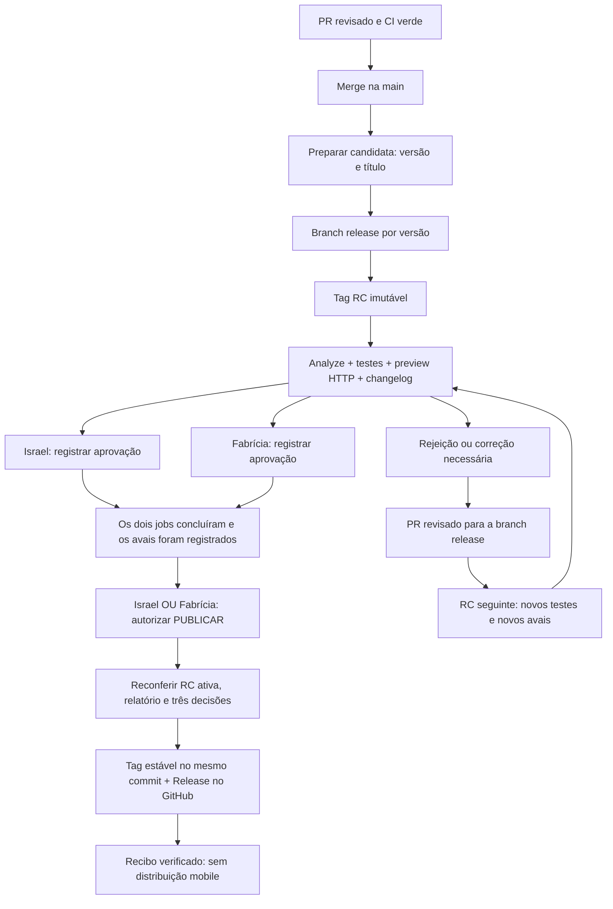

# Laboratório: aprovar a candidata e promover a versão no GitHub

A entrega passa por três decisões diferentes: **revisar o código**, **aprovar a
candidata** e **mandar publicar**. Israel **E** Fabrícia aprovam a mesma RC;
depois Israel **OU** Fabrícia autoriza a promoção. A promoção cria uma tag estável
e uma Release real no GitHub, apontando ao commit aprovado. **Não distribui o
aplicativo**, não gera patch Shorebird e não envia builds às lojas.

Este guia descreve a implementação de promoção GitHub-only. Sua existência não
prova ativação remota nem a execução de todos os cenários. Consulte a
[matriz de validação e evidências](VALIDACAO-E-PROMOCAO.md) para separar o que
passou em testes locais, o que foi observado no GitHub e o que permanece pendente.
A candidata do primeiro ensaio, `v1.4.0-rc.1`, tinha resultado final simulado;
suas aprovações não autorizam retroativamente uma publicação real.

## Quem faz o quê

| Responsabilidade | Conta/regra do laboratório |
|---|---|
| Preparar uma candidata ou iniciar recuperação | Israel, `israelhudson` |
| Aprovar a candidata | Israel **E** Fabrícia, `fahnassau30` |
| Dar o comando final de publicação | Israel **OU** Fabrícia |
| Revisar PRs de código | Revisor técnico elegível, diferente do autor do PR |

Fabrícia não se torna revisora técnica automaticamente. O autor de um PR não
pode aprovar o próprio PR. Os checks e as reviews do código são independentes
dos avais da candidata.

Uma lista de revisores em um único GitHub Environment funciona como **OU**.
Por isso existem duas etapas obrigatórias, com uma conta exclusiva cada:
`aprovacao-israel` e `aprovacao-fahnassau30`. A terceira etapa usa
`autorizar-publicacao` com ambas as contas, só depois das duas primeiras terem
concluído. No LAB, uma conta pode preparar e aprovar uma candidata, mas essa
exceção não muda a regra de autoria dos PRs. Todos os Environments recusam bypass
administrativo.

O histórico do GitHub comprova **qual conta autenticada registrou a review**.
Ele não comprova quem estava operando essa conta nem que houve uma análise
independente. Ensaios automatizados autorizados com as duas contas devem ser
identificados como teste de integração; não substituem uma revisão de produto
por duas pessoas.

## Preparar a candidata

**Conta para iniciar no LAB atual: `israelhudson`.** A política `operators`
autoriza somente Israel a preparar a RC. Fabrícia é aprovadora e pode dar o
comando final depois dos dois avais, mas não inicia a preparação. Essa restrição
é uma escolha da política do laboratório, não uma regra geral do GitHub.

1. Integre os PRs de código revisados na `main`. Ela acumula mudanças; não existe
   branch beta neste fluxo.
2. No Actions, abra **LAB - Preparar candidata** e selecione **Run workflow**
   na `main`.
3. Informe **versão** e **título**. A automação resolve e registra commit, tags,
   identidade dos artefatos e ferramenta confiável; ninguém precisa copiar hashes.
4. Aguarde `flutter analyze`, `flutter test`, build web e publicação do preview.
   O link é verificado por HTTP antes de abrir as aprovações.
5. Leia o resumo da candidata: título, versão, tag RC, preview, changelog
   acumulado, classificação por plataforma e **modo de publicação**.

Para a versão `1.4.0`, o primeiro corte cria `release/1.4.0` e
`v1.4.0-rc.1`. Uma nova RC da mesma versão usa o HEAD da branch release.
O código não é reconstruído a partir de uma `main` que avançou durante a revisão.
O registro congela fonte, ferramentas, política, relatório e preview. Não usa
“latest” para decidir o que foi aprovado.

Tags criadas pelo `GITHUB_TOKEN` não iniciam automaticamente outro workflow de
push. A preparação chama a avaliação reutilizável explicitamente. Uma tag criada
fora do diário confiável não autoriza uma entrega: a avaliação a recusa.

Existe uma candidata ativa de cada vez. Preparar outra candidata preserva a RC
anterior e invalida sua possibilidade de publicação. Rejeição, cancelamento,
falha técnica ou etapa ignorada nunca contam como aprovação. Uma promoção
parcial já iniciada exige recuperação antes de permitir outro corte.

Se a preparação for recusada por **iniciador não autorizado**, confira o diário
e as refs antes de continuar. Quando nenhuma RC foi criada, mantenha a mesma
versão/título e inicie uma **nova execução em Run workflow** com uma conta de
`operators`. Preserve a execução recusada como evidência. Não use **Re-run jobs**:
o helper também recusa tentativas posteriores do mesmo run e não troca seu
iniciador original. Não é preciso apagar a entrega nem avançar para RC2 nesse caso.

## O que significa “Approve and deploy”

Esse texto pertence à interface do GitHub. **O ambiente selecionado define o que
o clique libera.** Nos ambientes de aprovação, ele libera somente um job que
confere a conta autenticada e grava o aval da RC. O job não compila novamente o
app, não cria uma tag estável e não publica uma Release.

| Etapa visível no Actions | Efeito depois do clique |
|---|---|
| **Registrar aprovação — Israel** | Conferir e registrar somente o aval da conta de Israel |
| **Registrar aprovação — Fabrícia** | Conferir e registrar somente o aval da conta de Fabrícia |
| **AUTORIZAR PUBLICAR — Israel OU Fabrícia, após os dois avais** | Registrar o comando final; liberar a reconferência e promoção |
| **PROMOVER — tag estável e Release no GitHub** | Criar/confirmar a tag estável e a Release no commit aprovado |

O número no botão é a quantidade de Environments selecionados, não o número de
aprovações ainda necessárias. Mesmo que uma pessoa aprove primeiro, **a outra
aprovação continua obrigatória**. Depois de 2/2, ainda falta o comando final
separado. Os jobs que registram os avais precisam rodar para validar e guardar
evidência; vê-los executar não significa que a versão foi publicada.

## Aprovar e mandar publicar

1. Israel abre a execução com a própria conta, lê o preview e o changelog e
   aprova `aprovacao-israel` em **Review deployments**.
2. Fabrícia faz o mesmo para `aprovacao-fahnassau30`. A ordem é livre.
3. Aguarde os dois jobs de registro terminarem com sucesso. Um clique seguido
   de falha de validação não basta para liberar publicação.
4. Em **Review deployments**, Israel ou Fabrícia seleciona
   `autorizar-publicacao`. Este é o comando final separado, após os dois avais.
5. O job de promoção reconfere RC, commit, relatório, política, proteções e
   histórico das três reviews antes de produzir efeitos no GitHub.
   As proteções são consultadas novamente depois da espera pelas reviews e
   antes da criação da tag e da Release; a validação inicial não é suficiente.
6. Confira o recibo e abra a Release resultante. A automação verifica por GET a
   tag e a Release; somente então marca a promoção como concluída.

Permissão para iniciar um workflow não equivale a aprovação. `github.actor`
identifica o iniciador, não necessariamente a conta que aprovou. A automação
consulta o histórico oficial de reviews do run e os Environments exatos. Recibos
locais, comentários, hashes digitados e decisões de uma RC anterior não
substituem essa evidência.

## Tags e Release: a RC permanece no histórico

Promover `v1.4.0-rc.2` cria **uma nova tag `v1.4.0`** no mesmo commit. Não renomeia,
move ou apaga a RC. A GitHub Release usa a tag estável, o título e o changelog do
relatório aprovado, com `draft=false` e `prerelease=false`.

| Objeto | Significado |
|---|---|
| `release/1.4.0` | Linha de correções dessa entrega |
| `v1.4.0-rc.1` | Primeiro snapshot candidato, preservado mesmo se rejeitado |
| `v1.4.0-rc.2` | Novo snapshot após correção, com avaliações e avais novos |
| `v1.4.0` | Snapshot estável aprovado; mesmo commit da RC promovida |
| GitHub Release de `v1.4.0` | Registro real da versão e das evidências no GitHub |

Se a tag estável já existir com outro commit, a operação falha sem sobrescrevê-la.
Uma Release existente com identidade ou conteúdo divergentes também bloqueia a
promoção. Receber sucesso de um POST não basta: o estado publicado precisa ser
lido e conferido. A branch release não é apagada automaticamente.

O rótulo “estável” representa promoção no catálogo GitHub deste LAB. Não prova
que a versão chegou aos clientes do aplicativo ou à produção da Amulets.

**Refinamento planejado em 08/10/2026:** manter as RCs como evidência e apresentar
um resumo semitécnico no aviso do Slack. A IA roda em workflow independente;
se o resumo não estiver pronto ao abrir a revisão, usar os commits. Os dois
revisores leem o mesmo material congelado; saída tardia não o substitui.
Ver [contrato, exemplo e cenários](CHANGELOG-E-AVISOS-SLACK.md). Esse processamento
ainda não foi ativado no workflow.

## Rejeitar ou corrigir uma candidata: RC1 → RC2

1. Registre a rejeição com comentário no Environment, explicando o problema.
   A candidata não pode avançar com um gate rejeitado.
2. Crie uma branch de correção a partir de `release/1.4.0`.
3. Abra PR para `release/1.4.0`, obtenha revisão técnica de uma pessoa elegível
   e integre somente depois dos checks verdes. Não faça push direto à release.
4. Execute **Preparar candidata** novamente, com a mesma versão e título
   atualizado. A automação cria `v1.4.0-rc.2` a partir da release corrigida.
5. Confira novo preview e changelog. **Nenhum aval da RC1 é reaproveitado**;
   Israel e Fabrícia aprovam novamente e alguém dá novo comando final.
6. Promova RC2: a tag estável aponta ao commit de RC2, mesmo que a `main` tenha
   recebido outras features nesse intervalo.
7. Leve a correção para a `main` por outro PR revisado. Preserve as features
   que já estão nela; não importe essas features para a release nem reescreva o
   histórico para transportar a correção.

Não use **Re-run jobs** para reaproveitar decisões: tentativas posteriores do
mesmo run são recusadas. Falha antes de iniciar uma promoção pede uma nova RC.
Falha **depois da intenção de publicar ter sido gravada** segue a recuperação
abaixo. A candidata simulada do primeiro ensaio fica preservada; prepare outra
RC com modo real explícito no relatório e obtenha novos avais.

## Recuperar uma promoção parcial

A tag e a Release são duas chamadas diferentes à API. Pode existir tag estável
sem Release, ou a API pode concluir um POST e a resposta se perder. O diário
registra a intenção original antes dessas operações e mantém a promoção parcial
visível. Nessa situação, não corte outra candidata e não apague a tag para tentar
novamente.

1. Abra **LAB - Recuperar promoção**, na `main`, e informe apenas a **tag RC**.
2. Leia o diagnóstico. O job inicial consulta a intenção e recupera internamente
   relatório, commit, ferramentas e run originais; não cria tag ou Release.
3. Israel ou Fabrícia dá uma **nova autorização de recuperação** no Environment
   final. A espera humana não segura o bloqueio de publicação.
4. O job de recuperação reconfere os dois avais e o comando originais, além da
   nova autorização. Ele completa somente os efeitos ausentes da mesma promoção.
5. Confira tag, Release, recibo original e registro de quem autorizou a recuperação.

Recuperação não é uma forma de publicar outra RC, trocar o changelog ou dispensar
avais. Conflito de identidade, política alterada, conta não autorizada ou review
ambígua bloqueiam a recuperação. O recibo mantém quem deu o comando original e
registra separadamente a conta que autorizou a recuperação.

## Classificação mobile antes da aprovação

O relatório informa, para Android e iOS, a base pretendida, a previsão e o motivo:
**Patch possível**, **Loja / nova release nativa** ou **Inconclusivo — alvo
bloqueado**. A comparação cobre a diferença acumulada para a release-base;
o diff entre RCs não prova compatibilidade mobile.

O LAB ainda não tem release-base mobile comprovada. Portanto a classificação
inicial é **Inconclusivo — alvo bloqueado**. Isso permite exercitar o catálogo
GitHub-only, mas não autoriza um patch nem uma entrega móvel. Mudanças nativas,
SDK e assets incompatíveis exigem nova release nativa. Dependência somente Dart
exige inspeção do efeito completo; sua presença isolada não prova elegibilidade.

Uma futura integração Shorebird precisa de base e destino exatos, toolchain,
comparação de artefatos reais, credenciais e verificação no dispositivo. Publicar
uma Release no GitHub, subir um build à loja e disponibilizá-lo a testers são
resultados diferentes; cada um precisa de evidência própria.

## Proteções, runners e logs

- `main` e `release/**` exigem PR revisado e o check **Flutter analyze e test**.
  O autor não aprova seu próprio PR; defina quem é revisor técnico elegível.
- Tags candidatas e estáveis precisam de proteção efetiva contra atualização e
  exclusão, sem bypass. A proteção antiga `entrega-*-rc.*` não cobre `v*-rc.*`.
- O diário Git é protegido contra exclusão e reescrita. Cada decisão vincula RC,
  fonte, relatório, run, conta e Environment. Preserve os registros anteriores.
  Essa proteção não impede que uma conta com escrita acrescente um commit
  malicioso em fast-forward ou que um administrador altere as regras. O LAB
  pressupõe escritores e administradores confiáveis; não é um registro
  resistente à adulteração por esses atores.
- Corte, promoção e recuperação usam o mesmo bloqueio curto de mutação. Os jobs
  de aprovação e autorização não o usam. Assim um corte não pode substituir a
  RC entre a última conferência e os efeitos externos de uma promoção.
- O GitHub pode substituir um job que ainda está pendente na mesma concurrency
  group. Isso não significa sucesso nem deve cancelar uma publicação já rodando;
  preserve o run cancelado e verifique o diário antes de repetir a ação.
- Testes e build do aplicativo usam runner com acesso somente de leitura. Um
  runner novo, com privilégio de Pages, executa só ferramentas confiáveis e
  valida os bytes recebidos. A promoção e a recuperação também usam runners
  novos; não executam o app ou dependências com token de escrita.
- Artefatos do Actions preservam cortes, avaliação, reviews, intenção, recibo e
  recuperação por 90 dias. Logs, links e checksums precisam ser guardados antes
  da expiração; um link expirado não é evidência consultável.
- Workflows antigos permanecem arquivados. Não reative um caminho paralelo para
  publicar sem os mesmos bloqueios e a mesma identidade aprovada.

O `GITHUB_TOKEN` precisa ter permissões suficientes para os efeitos no GitHub.
Criar uma tag em um commit congelado que contém arquivos de workflow pode ser
recusado quando a autorização de **Workflows write** não estiver disponível,
especialmente se a `main` avançar durante a revisão. `contents: write` isolado
não prova que essa operação será aceita. O LAB não contorna uma recusa trocando
o commit aprovado ou removendo arquivos; guarda a falha e permanece bloqueado.
Rerun não resolve permissão insuficiente. Uma futura credencial de GitHub App
com escopo apropriado exige configuração e validação próprias, sem reduzir os
gates nem expor o token ao build do app.

## Aplicar à Amulets

Migre a política por responsabilidades, e não copiando nomes de contas do LAB.
O planejamento Amulets usa Samuel **E** Vinícius para a candidata e Samuel
**OU** Vinícius para o comando final; confirme contas, acessos, preparador e
revisores técnicos antes de habilitar.

**Pergunta pendente para Samuel:** quem poderá gerar RCs, substituir o
preparador e iniciar recuperação na Amulets? Registre a resposta no
[plano de evolução](../plano-evolucao-esteira.md#decisão-com-samuel-quem-poderá-gerar-uma-rc-na-amulets)
antes de configurar `operators` no projeto de destino. Não copiar a restrição
a Israel sem uma decisão do time.

Confira primeiro o plano GitHub e a disponibilidade de required reviewers no
repositório privado. Os gates deste LAB público não comprovam disponibilidade
no privado da Amulets em Team. Defina adaptadores separados para GitHub, stores
e Shorebird; mantenha plataforma, release-base, destino e resultado congelados.
O aceite de UI/negócio continua humano, mesmo que os controles sejam ensaiados
com automação autorizada. Use a [matriz e as lições](VALIDACAO-E-PROMOCAO.md) para
aplicar apenas comportamentos efetivamente validados.

Fontes oficiais: [Environments e reviewers](https://docs.github.com/en/actions/reference/workflows-and-actions/deployments-and-environments),
[concurrency](https://docs.github.com/en/actions/how-tos/write-workflows/choose-when-workflows-run/control-workflow-concurrency),
[eventos e GITHUB_TOKEN](https://docs.github.com/en/actions/concepts/security/github_token),
[histórico de reviews](https://docs.github.com/en/rest/actions/workflow-runs#get-the-review-history-for-a-workflow-run)
e [referência Shorebird deste projeto](../../referencias/docs/004-shorebird-patch-e-elegibilidade.md).
