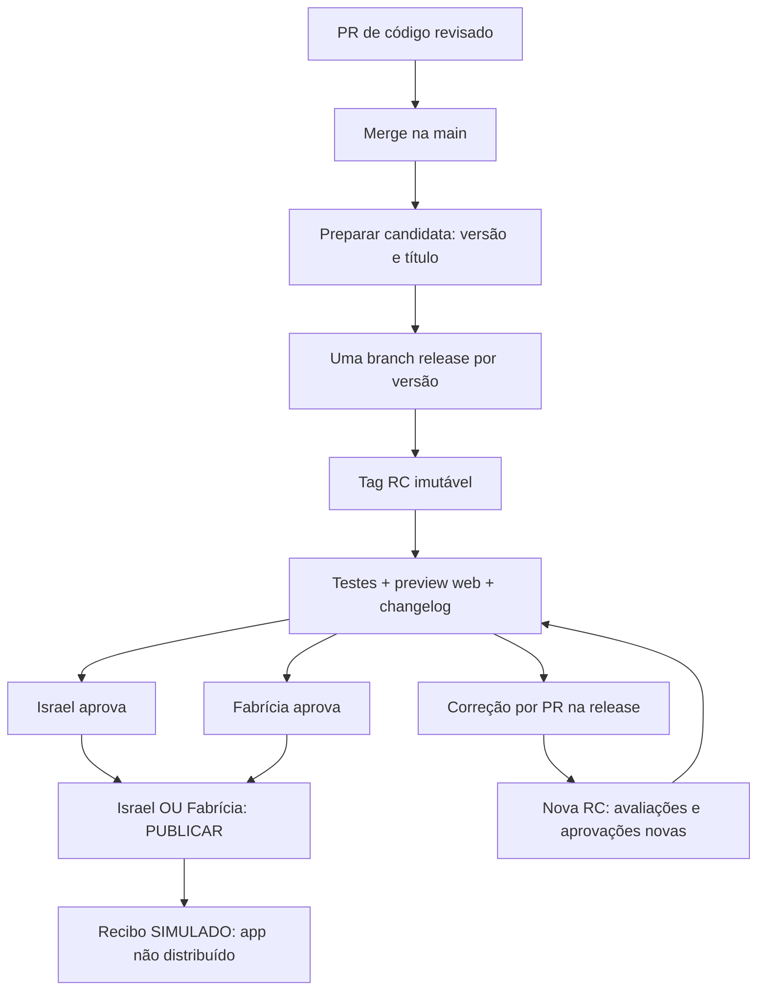

# Laboratório: Israel e Fabrícia aprovam a mesma candidata

Este fluxo substitui as execuções dos workflows antigos, preservando seus arquivos
e o histórico. Sua ativação exige integrar a implementação na `main` e conferir
os Environments e as proteções descritos abaixo. A existência deste guia não
comprova um ensaio com duas contas humanas.

**O preview, o changelog, as duas aprovações e a decisão de PUBLICAR são reais.
Somente o resultado final é SIMULADO.** Não há build mobile, geração de patch,
envio para lojas ou distribuição de aplicativo neste fluxo.

## Quem faz o quê

| Responsabilidade | Conta/regra do laboratório |
|---|---|
| Preparar a entrega | Israel, `israelhudson` |
| Aprovar a candidata | Israel **E** Fabrícia, `fahnassau30` |
| Acionar a decisão final | Israel **OU** Fabrícia |
| Revisar PRs de código | Revisor técnico elegível, diferente do autor do PR |

Fabrícia não se torna revisora técnica automaticamente. O autor não pode aprovar
o próprio PR. A revisão do código é independente da aprovação da entrega.
No laboratório, uma pessoa pode preparar e aprovar uma candidata; por isso os
Environments permitem aprovação pelo iniciador. Essa exceção não remove a regra
de autoria dos PRs.

Uma única lista de revisores de Environment funciona como **OU**. Para exigir
os dois, há duas etapas obrigatórias: `aprovacao-israel` e
`aprovacao-fahnassau30`. A etapa final usa `autorizar-publicacao` com ambos como
revisores possíveis, depois das duas primeiras etapas. Aprovar a versão não
executa automaticamente a decisão final.

## Preparar a candidata

1. Integre os PRs de código revisados na `main`. Ela acumula as mudanças; este
   fluxo não usa uma branch beta.
2. No Actions, abra **Preparar candidata** e selecione **Run workflow**.
3. Informe a **versão** e um **título da entrega**. Não copie SHA, hash ou ID de
   artefato: a automação resolve essas identidades e as registra.
4. Aguarde a avaliação. Ela testa o código, gera um preview Flutter web real e
   registra o changelog e a classificação preliminar por plataforma.
5. Abra o link fixo do preview e o registro da candidata no resumo da execução.

Para uma versão `1.4.0`, o primeiro corte cria `release/1.4.0` e a tag
`v1.4.0-rc.1`. O snapshot é código versionado. O preview é o artefato web
compilado desse código; são evidências diferentes. A candidata vincula tag,
commit, versão, título, preview e changelog, sem depender de “latest”.

Tags criadas pelo `GITHUB_TOKEN` não iniciam automaticamente um workflow de push.
A preparação chama a avaliação explicitamente. Isso evita depender de um evento
que o GitHub suprime e evita avaliações duplicadas.

Uma tag enviada manualmente só pode avaliar uma candidata que já exista no
diário confiável. Criar uma tag fora desse registro falha fechado. O caminho
operacional completo desta versão é **Preparar candidata** no Actions.

Existe apenas uma candidata ativa. Outra RC preserva o histórico da anterior e
bloqueia sua decisão final. Falha técnica, rejeição ou cancelamento não contam
como aprovação.

Israel e Fabrícia podem aprovar em qualquer ordem. A etapa PUBLICAR exige a
conclusão bem-sucedida das duas etapas obrigatórias.

## Aprovar e decidir PUBLICAR

1. **Israel** abre a execução da candidata, consulta o preview e o changelog e
   aprova sua etapa em **Review deployments**.
2. **Fabrícia**, autenticada na própria conta, consulta os mesmos registros e
   aprova a etapa dela.
3. Só depois das duas aprovações, **Israel ou Fabrícia** revisa a etapa
   **PUBLICAR** e toma a decisão final separadamente.
4. A automação reconfere a candidata ativa, suas identidades e o histórico real
   das aprovações. Registra um recibo explícito de **resultado SIMULADO**.

Ter permissão para iniciar um workflow não é uma aprovação. O iniciador da
execução não identifica quem aprovou um Environment: a automação confere o
histórico oficial de reviews, incluindo a identidade da conta e o Environment
exato. Campos editáveis, comentários, fixtures e um recibo anterior não
substituem essa evidência.

O agente pode preparar e conferir a execução, mas não pode fabricar uma
aprovação da conta de Fabrícia. As duas contas precisam efetivamente aprovar.

## Corrigir uma candidata

1. Crie uma branch de correção a partir de `release/1.4.0`.
2. Abra um PR para essa branch release, obtenha revisão técnica e integre o
   conserto depois dos testes.
3. Execute **Preparar candidata** novamente para a mesma versão e um título
   atualizado. A automação fixa o HEAD da release em `v1.4.0-rc.2`.
4. Examine o novo preview e changelog. Israel e Fabrícia aprovam novamente; os
   avais da RC anterior não são reutilizados.
5. Leve o conserto para a `main` por outro PR, preservando as features novas que
   já estiverem nela. Não importe essas features para a release nem reescreva
   o histórico.

Não use **Re-run jobs** para aproveitar decisões antigas: tentativas posteriores
da mesma execução são recusadas. Para falha ou alteração da candidata, prepare
a próxima RC na mesma branch. Tags anteriores nunca são movidas ou apagadas.

Em uma futura publicação real, a tag final deverá apontar ao commit aprovado da
release, mesmo se a `main` já tiver avançado. A branch release só será removida
depois da entrega e da integração dos consertos. Este laboratório registra
somente um recibo; não simula que uma entrega mobile aconteceu.

## Classificação antes da aprovação

O changelog informa, por plataforma, a base pretendida, a previsão e o motivo:
**Patch possível**, **Loja / nova release nativa** ou **Inconclusivo — alvo
bloqueado**. A comparação precisa abranger toda a diferença para a release-base,
incluindo mudanças acumuladas e transitivas; a diferença entre RCs não prova
compatibilidade mobile.

Neste primeiro fluxo não há release-base mobile comprovada. O resultado inicial
é **Inconclusivo — alvo bloqueado**, claramente registrado antes da aprovação.
Isso não bloqueia o ensaio web e o recibo simulado, mas impede apresentá-los como
autorização de patch ou prova de distribuição mobile.

Mudanças nativas, SDK e assets empacotados incompatíveis exigem uma nova release
nativa. Usar um asset já existente na base ou alterar uma dependência somente
Dart não força loja automaticamente: é necessário verificar o efeito completo.
Uma futura geração de patch precisará conferir os artefatos reais do Shorebird,
sem ignorar incompatibilidades ou trocar silenciosamente o destino aprovado.

## Evidências e configuração para ativação

- Resumos e artefatos do Actions preservam manifesto, changelog, preview, reviews
  e recibo, com retenção de **90 dias**. Guarde os links e hashes no registro da
  candidata; um artefato expirado deixa de ser uma evidência consultável.
- O diário Git mantém os estados ligados à mesma candidata. Proteja sua branch
  contra exclusão e reescrita; os registros não substituem as reviews oficiais.
- As tags `v*-rc.*` precisam estar protegidas contra alteração e exclusão, sem
  bypass. A proteção antiga para `entrega-*-rc.*` não cobre esse novo namespace.
- Proteja `main` e branches release com revisão técnica. Defina quem pode
  preparar a candidata e valide a configuração efetiva dos três Environments.
- Para a instalação inicial, integre o PR de implementação antes de habilitar
  a nova regra de review técnico. Depois da configuração, PRs exigem uma
  aprovação de uma pessoa elegível diferente do autor; não fixe Fabrícia nesse
  papel sem a decisão correspondente.
- Os dois Environments de aprovação têm um revisor exclusivo cada um. O
  Environment final contém Israel e Fabrícia. Configure todos sem bypass de
  administrador e restrinja as referências permitidas ao fluxo confiável.
- Workflows antigos deixam de aceitar novos eventos; arquivos, runs, releases
  e capturas anteriores permanecem como histórico. Não use o recibo antigo de
  um fluxo com uma única conta como prova deste novo fluxo.

Os testes e a compilação do aplicativo rodam em um job com acesso somente de
leitura. O artefato passa para outro runner, novo, que executa exclusivamente as
ferramentas confiáveis para publicar. Esse runner confere commit, árvore Git,
entradas de build, fingerprint e arquivos estáticos antes de importar o preview.
Repositórios `.git`, links simbólicos, snapshots extras e identidades divergentes
são recusados; snapshots históricos não são sobrescritos.

O aceite inclui: testes falham e bloqueiam; zero ou uma aprovação não liberam
PUBLICAR; duas aprovações só liberam a decisão separada; uma nova RC exige duas
novas aprovações; uma RC antiga e tentativas repetidas são recusadas. Testes
offline desses casos são evidência técnica, não duas aprovações humanas reais.

## Lições para Amulets

Migre a política por papéis, sem fixar os nomes do laboratório: Samuel **E**
Vinícius aprovam; Samuel **OU** Vinícius toma a decisão final. Confirme contas,
acessos, revisão técnica e preparador antes de ativar. Required reviewers de
Environment para repositório privado dependem do plano GitHub; não presumir que
os gates deste repositório público estão disponíveis na Amulets privada em Team.

Fontes oficiais: [Environments e disponibilidade](https://docs.github.com/en/actions/reference/workflows-and-actions/deployments-and-environments),
[eventos e GITHUB_TOKEN](https://docs.github.com/en/actions/concepts/security/github_token),
[histórico de reviews da execução](https://docs.github.com/en/rest/actions/workflow-runs#get-the-review-history-for-a-workflow-run)
e [elegibilidade Shorebird](../../referencias/docs/004-shorebird-patch-e-elegibilidade.md).
