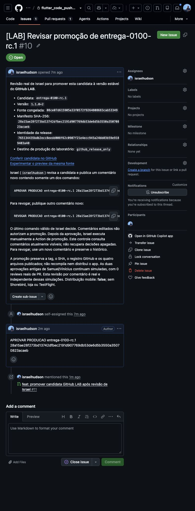
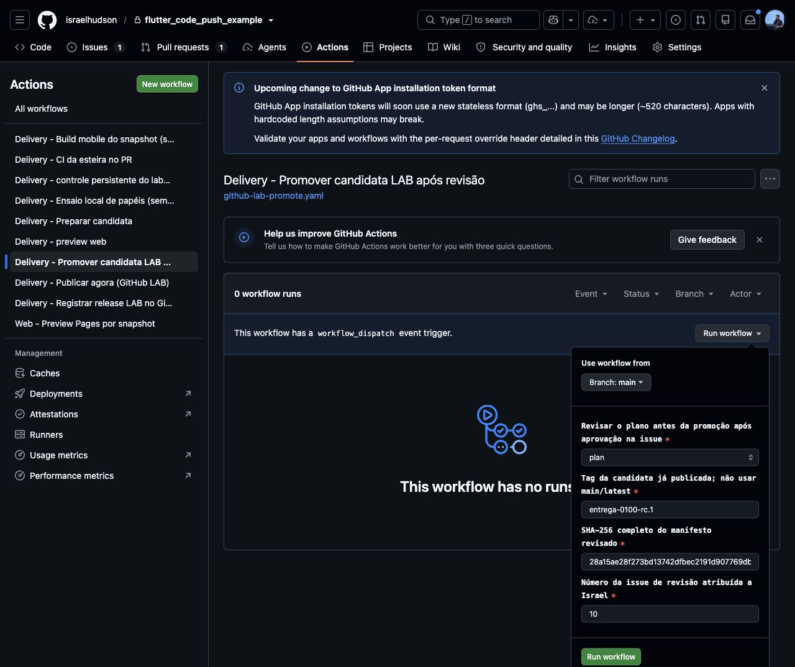
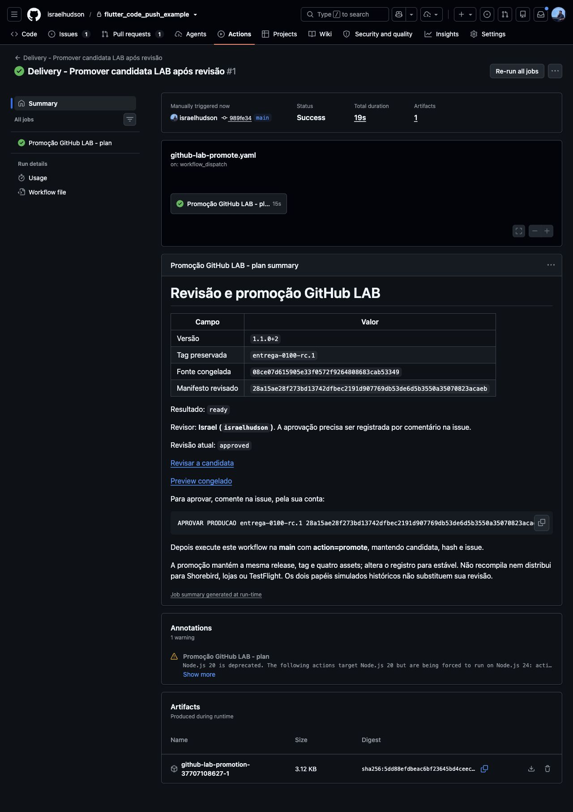
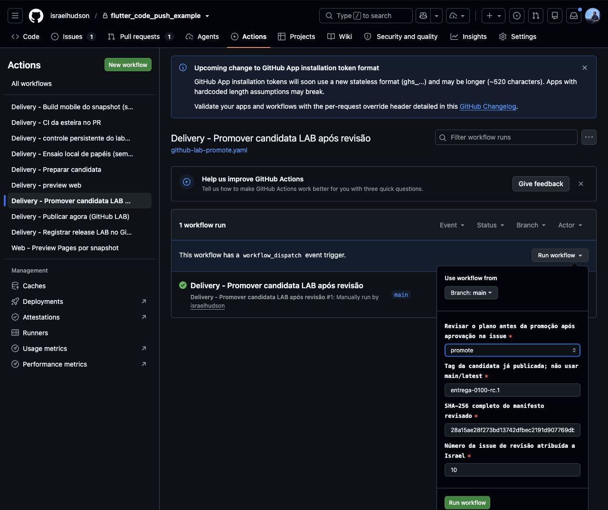
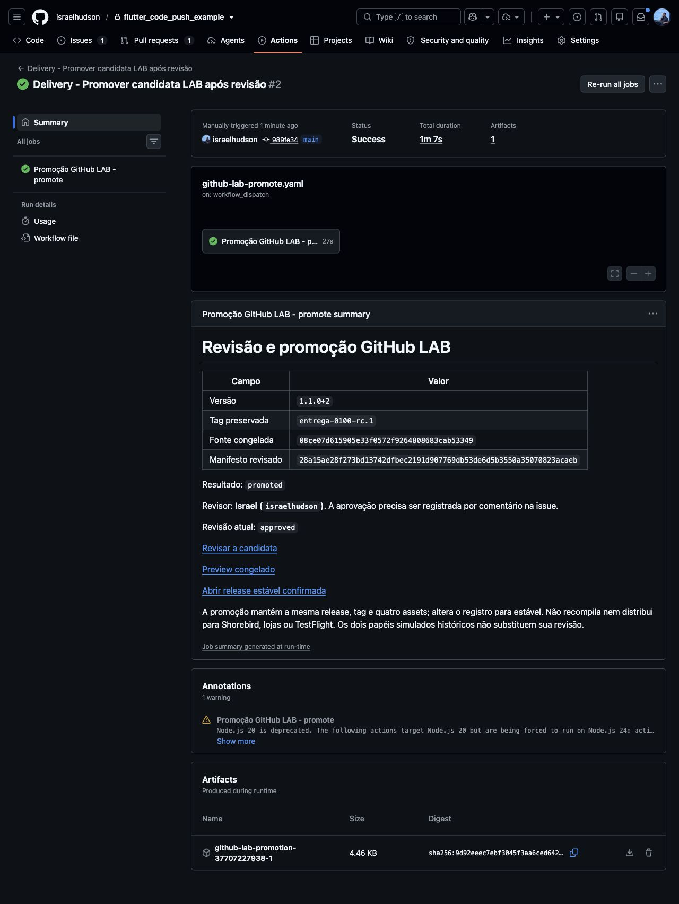
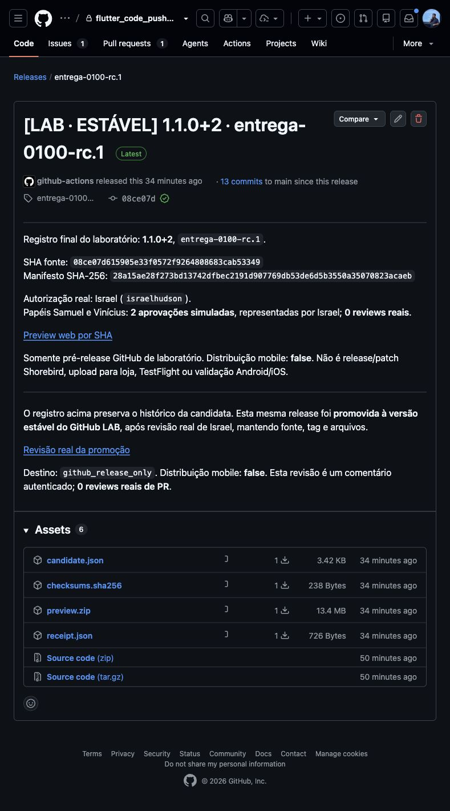

# Passo a passo — da candidata à release estável

Este roteiro documenta a promoção GitHub da candidata `entrega-0100-rc.1`.
Israel registrou a aprovação com sua conta real; depois autorizou o Codex
a executar os controles manuais e capturar as telas. A aprovação do usuário e
a execução delegada são ações distintas.

**Promoção concluída:** plano e promoção terminaram com sucesso. A mesma
Release `406248758` está estável no GitHub, com `draft=false` e
`prerelease=false`. As seis capturas abaixo documentam as telas observadas.

| Identidade congelada | Valor |
|---|---|
| Versão | `1.1.0+2` |
| Candidata/tag | `entrega-0100-rc.1` |
| Fonte | `08ce07d615905e33f0572f9264808683cab53349` |
| Manifesto | `28a15ae28f273bd13742dfbec2191d907769db53de6d5b3550a35070823acaeb` |
| Release ID | `406248758` |
| Revisão | [Issue #10](https://github.com/israelhudson/flutter_code_push_example/issues/10) |

## 1. Conferir a aprovação real de Israel

Na [issue #10](https://github.com/israelhudson/flutter_code_push_example/issues/10),
Israel publicou o [comentário de aprovação 6049452293](https://github.com/israelhudson/flutter_code_push_example/issues/10#issuecomment-6049452293)
às `2026-10-08T00:14:05Z` — 21:14:05 de 07/10/2026 em Fortaleza:

```text
APROVAR PRODUCAO entrega-0100-rc.1 28a15ae28f273bd13742dfbec2191d907769db53de6d5b3550a35070823acaeb
```

Esse aceite foi escrito pelo usuário. O Codex não publicou uma aprovação em
seu nome. Os papéis Samuel e Vinícius da preparação continuam simulados; essa
nova decisão do proprietário não transforma o histórico em reviews reais de PR.



## 2. Abrir o plano antes da promoção

Abra [Actions → Delivery - Promover candidata LAB após revisão](https://github.com/israelhudson/flutter_code_push_example/actions/workflows/github-lab-promote.yaml)
e clique em **Run workflow**. Preencha:

| Campo | Valor |
|---|---|
| Branch | `main` |
| `action` | `plan` |
| `candidate` | `entrega-0100-rc.1` |
| `manifest_hash` | `28a15ae28f273bd13742dfbec2191d907769db53de6d5b3550a35070823acaeb` |
| `review_issue` | `10` |

Execute o plano. Ele consulta a revisão atual, a tag e os assets congelados,
sem alterar a release. Nesta execução, o Codex preencheu o formulário e
clicou em **Run workflow** no navegador, conforme autorizado por Israel.



## 3. Conferir o resultado do plano

O [plano 37707108627](https://github.com/israelhudson/flutter_code_push_example/actions/runs/37707108627)
terminou com `SUCCESS`. O resultado confirmou a candidata, o hash, a fonte,
a versão, o comentário `6049452293` de Israel e a Release `406248758`.
O plano ficou pronto, com `promoted=false`: a release ainda não tinha sido
alterada. Resultado e eventos foram conferidos antes de prosseguir.



## 4. Executar a promoção autorizada

Volte ao mesmo workflow e abra **Run workflow**. Mantenha `main`, candidata,
hash e `review_issue=10`; troque somente `action` para `promote`.
O Codex também executou esta etapa pelo formulário do navegador, sob a
autorização expressa de Israel.

O helper relê a decisão atual de Israel e a identidade da candidata antes de
atualizar a release. Se a aprovação tiver sido revogada ou os bytes não
corresponderem ao manifesto, a promoção deve ser bloqueada.



## 5. Conferir a conclusão do run

O [run de promoção 37707227938](https://github.com/israelhudson/flutter_code_push_example/actions/runs/37707227938)
terminou com `SUCCESS`, com `promoted=true`. Resultado, eventos e checkpoint
confirmaram a mesma Release `406248758`, preservando tag, fonte e quatro
assets. A única mutação registrada foi `promote_release`: atualizar o registro
existente para estável.
A confirmação ocorreu às `2026-10-08T00:21:19.318614Z` — 21:21:19 de
07/10/2026 em Fortaleza.

Identidade da promoção: `c0ec683ceeb784663e0996124714d1f4ea09861dd6ba4944dbe67d03c973f8e3`.

Se houver falha ou timeout, conserve os logs e confira o estado remoto antes
de repetir. Um dispatch criado ou um run iniciado não confirma a promoção.



## 6. Abrir a release estável e conferir a identidade

O endereço continua sendo o da [mesma release](https://github.com/israelhudson/flutter_code_push_example/releases/tag/entrega-0100-rc.1).
O nome confirmado é **[LAB · ESTÁVEL] 1.1.0+2 · entrega-0100-rc.1**;
a API confirmou `draft=false` e `prerelease=false`. A tela exibe **Latest**.

Na conferência das `2026-10-08T00:22:46Z` — 21:22:46 de 07/10/2026 em Fortaleza —,
a fonte, a árvore, a tag anotada e os IDs/digests dos quatro assets continuavam
iguais. O estado do core permaneceu em
`b90cf65c3a47d507ee40649001176d663269b350`.

A tag conserva `rc.1`; ela identifica os mesmos bytes revisados. Não houve
nova tag, movimento de fonte, recompilação ou substituição de assets.
A tela mostra **Assets 6**: os quatro arquivos originais mais os dois arquivos
de código-fonte que o GitHub gera automaticamente. Isso não representa novos
uploads pelo workflow.



“Produção” aqui é o registro estável no GitHub do laboratório pessoal.
`distribution_performed=false`: não houve patch Shorebird, envio a lojas,
TestFlight ou validação mobile de produção. Nenhuma mudança foi aplicada à
Amulets.

O [log da promoção](evidencias/2026-10-07-promotion.jsonl) preserva a sequência
e as lições, junto dos [eventos do plano](evidencias/2026-10-07-promotion-plan-37707108627.jsonl),
dos [eventos da promoção](evidencias/2026-10-07-promotion-promoted-37707227938.jsonl)
e dos arquivos históricos da publicação anterior.
