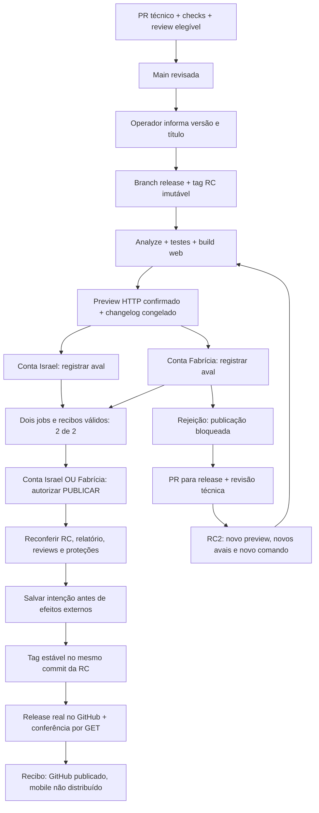

# Ensaio remoto: candidata, rejeição, correção e promoção no GitHub

Este relatório registra o laboratório de 8 de outubro de 2026 e as lições para
aplicar à Amulets. O destino deste ensaio é **tag estável e Release no GitHub**.
Android, iOS, Shorebird, lojas e distribuição para testers não são executados.

**Resultado comprovado: a [Release v1.5.0](https://github.com/israelhudson/flutter_code_push_example/releases/tag/v1.5.0)
foi publicada de verdade no GitHub**, no commit da RC2 corrigida. RC1 foi
rejeitada e preservada; RC2 começou sem herdar avais, recebeu dois novos avais e
um comando final separado. Os bloqueios 0/2, 1/2, rejeição, conta incorreta e
rerun foram observados. A publicação foi conferida por GET e pelo recibo final.
**Nenhum aplicativo ou patch foi distribuído.** Reviews foram de ensaio
automatizado por contas autorizadas, sem comprovação de independência humana.
Versão já publicada e versão antiga foram recusadas sem efeitos novos. O
backport da correção à main permanece PENDENTE até seus registros. Os nove
cenários offline são registrados separadamente.

## A diferença entre aprovação, comando e publicação

| Etapa | Quem pode agir | O que a ação produz |
|---|---|---|
| Preparar candidata | Operador autorizado Israel | Fonte/tag/versão/título congelados; não é aprovação |
| Review de código | Conta técnica elegível, diferente do autor | Review do PR; não é aval da entrega |
| Registrar aprovação Israel | Conta `israelhudson` | Um aval da candidata e evidência validada |
| Registrar aprovação Fabrícia | Conta `fahnassau30` | O outro aval da mesma candidata |
| Autorizar PUBLICAR | Israel OU Fabrícia, depois de 2/2 | Comando final separado; não altera a fonte aprovada |
| Promover | Automação confiável depois do comando | Nova tag estável + Release GitHub no commit da RC |
| Recuperar | Operador autorizado e nova autorização final | Completar efeitos ausentes da intenção original |

O botão **Approve and deploy** é da interface nativa GitHub. No Environment de
uma conta ele libera somente o job que registra seu aval. Uma conta aprovar não
publica a versão; a outra conta e o comando final continuam necessários. O
número no botão conta os Environments selecionados, não quantos avais faltam.

Uma lista de reviewers em um único Environment funciona como OU. Por isso os
dois primeiros Environments são separados e exclusivos; o terceiro contém os
dois usuários e funciona como OU, depois de ambos os primeiros jobs concluírem.

## Quem operou o ensaio e o que as reviews provam

O usuário autorizou Codex a executar ações de **ensaio** pela conta Fabrícia
aberta no Safari. A revisão da implementação foi enviada nessa sessão como
review automatizada, com comentário explícito sobre o teste. As etapas futuras
operadas pelo agente precisam manter a mesma identificação honesta.

O GitHub verifica uma conta autenticada. Isso **não comprova que a Fabrícia
pessoalmente revisou o produto**, nem uma avaliação independente feita por duas
pessoas. O recibo de promoção usa `account_review_verified=true`,
`approval_evidence_kind=github_account_review` e
`review_independence_verified=false`. Este relatório não converte um teste de
contas em aceite humano de negócio.

No fluxo da Amulets, revisores técnicos e aprovadores da candidata são papéis
separados. Fabrícia não se torna revisora técnica por padrão; neste LAB, o uso de
sua conta para a review de ensaio foi autorizado especificamente. O autor de um
PR não pode aprová-lo; o branch protegido e o check obrigatório permanecem ativos.

## Objetos e evidências principais

| Objeto | Identidade ou evidência |
|---|---|
| Implementação | [PR da promoção GitHub-only](https://github.com/israelhudson/flutter_code_push_example/pull/14) |
| Código integrado | `9c4ad37fc415a98ef2a8cfdc5be8d5cf97fe35b0` |
| CI da implementação | [Run com Flutter analyze/test e 273 testes da esteira](https://github.com/israelhudson/flutter_code_push_example/actions/runs/37850097988) |
| Log da CI | [implementation-ci.log](implementation-ci.log) |
| Review técnica de ensaio | [implementation-pr-before-merge.json](implementation-pr-before-merge.json) e [print](01-revisao-tecnica-automatizada.jpg) |
| Primeira candidata real | `v1.5.0-rc.1`, branch `release/1.5.0` |
| Título | Ensaio de rejeição, correção e promoção no GitHub |
| Avaliação/rejeição RC1 | [Primeira tentativa do run original](https://github.com/israelhudson/flutter_code_push_example/actions/runs/37850467026/attempts/1) |
| Teste negativo rerun RC1 | [Segunda tentativa recusada](https://github.com/israelhudson/flutter_code_push_example/actions/runs/37850467026/attempts/2) |
| Correção para release | [PR: identificar laboratório na candidata corrigida](https://github.com/israelhudson/flutter_code_push_example/pull/15) |
| CI da correção | [Run da correção proposta](https://github.com/israelhudson/flutter_code_push_example/actions/runs/37851354969) |
| Candidata corrigida | `v1.5.0-rc.2`, fonte `b8763ec5adc5e24ce34f474a66a079b48a9ffa0f` |
| Avaliação RC2 | [Run da candidata corrigida](https://github.com/israelhudson/flutter_code_push_example/actions/runs/37851607911) |
| Preview RC2 | [Snapshot corrigido verificado](https://israelhudson.github.io/flutter_code_push_example/snapshots/b8763ec5adc5e24ce34f474a66a079b48a9ffa0f/) |
| Versão estável | [Release real v1.5.0](https://github.com/israelhudson/flutter_code_push_example/releases/tag/v1.5.0), ID `407306454` |
| Preview RC1 | [Snapshot verificado](https://israelhudson.github.io/flutter_code_push_example/snapshots/9c4ad37fc415a98ef2a8cfdc5be8d5cf97fe35b0/) |
| Diário das observações | [actions.jsonl](actions.jsonl) |
| Fonte de estado/recibo | Branch `codex/release-lab-state`, `release-lab/state.json` |
| Testes offline finais | [9 cenários e suas limitações](../2026-10-08-real-promotion-offline-v3/summary.json) |
| Testes de promoção/configuração | [24 testes](../2026-10-08-real-promotion-offline-v3/unit-tests.log) e [5 testes](../2026-10-08-real-promotion-offline-v3/configuration-tests.log) |
| YAML final | [actionlint-final.json](../2026-10-08-real-promotion-workflows/actionlint-final.json) |

Os links relativos deste relatório apontam a evidências na mesma branch de
estado, fora da main. Os snapshots de teste não são adicionados ao PR de código.
Todos os horários mencionados em texto usam Fortaleza; os JSONs e logs preservam
os timestamps originais para comparação e auditoria.

## Passo 1 — integrar a implementação e conferir a CI

**PASS observado.** A implementação passou em Flutter analyze, Flutter test e
273 testes Python de contratos/bloqueios, e foi integrada pelo PR após review
registrada pela conta autorizada. O log registra `Ran 273 tests` e `OK`.

A CI confirma os checks desse snapshot. Não cria uma candidata nem publica a
Release. Sua review de ensaio não equivale a análise humana independente. O
print e o JSON preservam a origem da decisão e as proteções do PR.

## Passo 2 — preparar RC1 no modo GitHub-only

**PASS para o corte e a avaliação.** Às 18h58,
o operador iniciou a preparação de `1.5.0` com título legível. O corte criou a
branch release e a RC imutável no commit integrado, sem exigir hashes no formulário.

Na observação registrada logo após o corte:

- O run estava `in_progress`; corte e preflight concluíram com sucesso.
- O build web estava em andamento; relatório/preview ainda não estavam congelados.
- `publication_mode=github_release_only`, `status=evaluating` e nenhum recibo final.
- Não havia reviews nem tag estável/Release `v1.5.0`; os GETs registraram 404.

Provas: [run](rc1-preparing-run.json), [jobs](rc1-preparing-jobs.json),
[estado](rc1-preparing-state.json), [reviews](rc1-preparing-reviews.json),
[tags RC](rc1-preparing-rc-refs.json), [estável ausente](rc1-preparing-stable-ref.json)
e [Release ausente](rc1-preparing-stable-release.json).

A ausência de reviews enquanto o build ainda roda não comprova sozinha o gate
0/2. Esse bloqueio deve ser observado **depois** de preview e relatório prontos,
com os dois jobs de aprovação efetivamente aguardando.

Na observação seguinte, às 19h02, analyze/test, build e publicação/HTTP do preview
concluíram com sucesso. O diário registrou `awaiting_approvals` e um relatório
congelado com `result_simulated=false`; os dois gates estavam `waiting`, as
reviews estavam vazias e a tag estável/Release continuavam ausentes. Assim o
bloqueio 0/2 foi observado depois da avaliação, não presumido durante o build.

Provas dessa transição: [jobs](rc1-zero-approvals-jobs.json),
[estado e relatório](rc1-zero-approvals-state.json), [reviews](rc1-zero-approvals-reviews.json),
[gates pendentes](rc1-zero-approvals-pending.json),
[estável ausente](rc1-zero-approvals-stable-ref.json) e
[Release ausente](rc1-zero-approvals-stable-release.json).

[Print do estado com zero aprovações](02-rc1-zero-aprovacoes.jpg).

O relatório distingue versão do catálogo GitHub (`1.5.0`) de versão atual do
pubspec (`1.1.0+2`). Este LAB não constrói nem distribui mobile. Antes de migrar,
defina uma regra explícita de alinhamento entre versão da entrega e versão/build
do app; uma tag GitHub não altera automaticamente o pubspec ou a release-base.

## Passo 3 — provar 0/2 e 1/2 antes de rejeitar RC1

**PASS para 0/2, 1/2 e rejeição.** O roteiro executado é:

1. Após preview/changelog, registrar 0/2: ambos os gates aguardam, autorização
   final e promoção não iniciaram e não há estável/Release.
2. Aprovar somente Israel e esperar o job de registro terminar.
3. Registrar 1/2: diário contém apenas um recibo, Fabrícia continua obrigatória,
   final não inicia e catálogo permanece sem a versão estável.
4. Rejeitar o gate Fabrícia com comentário de ensaio e motivo da correção.
5. Registrar a rejeição: review oficial `rejected`, job final/promoção não
   executados, nenhum recibo de conclusão ou versão estável.

Os jobs de registro conferem reviewer ID/login, Environment e relatório da RC.
Rodar esse job é necessário para guardar a decisão; não é um novo build ou deploy.

Na observação 1/2, o gate Israel concluiu com sucesso e o diário contém somente
o recibo `first`, correspondente à conta `israelhudson`. A review traz comentário
explícito de ensaio automatizado autorizado. Fabrícia continuava aguardando;
autorização final/promoção não iniciaram, não havia recibo final e tag/Release
estáveis continuavam ausentes. Isso confirma o efeito do primeiro clique.

Provas: [pedido do aval de ensaio](rc1-israel-approval-request.json),
[reviews](rc1-one-approval-reviews.json), [jobs](rc1-one-approval-jobs.json),
[estado com um receipt](rc1-one-approval-state.json),
[pendências](rc1-one-approval-pending.json),
[estável ausente](rc1-one-approval-stable-ref.json) e
[Release ausente](rc1-one-approval-stable-release.json).

[Print com um aval e Publicar bloqueado](03-rc1-um-aval-publicar-bloqueado.jpg).

A conta Fabrícia rejeitou o gate da RC1, com comentário explícito de automação
de ensaio. O run encerrou com `completed/failure`; a autorização final e o job
de promoção foram `skipped`. O diário não recebeu recibo de conclusão, e tag
estável/Release continuam ausentes. O receipt Israel permanece como história;
sozinho ele não autoriza entrega nem deve ser transferido à RC2.

O journal local da execução rejeitada ainda mostra `awaiting_approvals`: o job
do Environment rejeitado não chegou a executar o helper que grava decisões.
Portanto, a prova da rejeição é o histórico oficial de reviews e o estado do
run/job, não somente o campo resumido do journal. A preparação da RC seguinte
deverá marcar a antiga como supersedida. Para uma interface Amulets, reconcilie
essas fontes para não exibir uma candidata rejeitada como revisão saudável em espera.

Provas: [review de rejeição](rc1-rejected-reviews.json),
[jobs após rejeição](rc1-rejected-jobs.json), [estado](rc1-rejected-state.json),
[estável ausente](rc1-rejected-stable-ref.json),
[Release ausente](rc1-rejected-stable-release.json) e
[print da RC1 rejeitada](04-rc1-rejeitada-sem-promocao.jpg).

## Passo 4 — corrigir por PR na release e criar RC2

**PASS para PR, CI, review de ensaio, merge e novo corte RC2.** A correção de ensaio altera a mensagem do app e seu teste, com branch
baseada na `release/1.5.0`. Ela precisa passar em CI e em review técnica por
conta elegível antes do merge. Não há push direto à release.

O PR **identificar laboratório na candidata corrigida** propõe trocar o título
visível por **Laboratório de atualizações**, junto da expectativa no widget
test. O commit proposto é `4d3043f4cb5ce32abc98438067df2627599e02b5`.
Essa mudança visível permite distinguir o preview da RC2 do primeiro candidato;
abrir o PR não significa por si só que a correção já foi integrada.

A CI da correção concluiu com `SUCCESS`, a conta `fahnassau30` registrou uma
review técnica explicitamente automatizada e o PR foi integrado às 19h08, no
commit `b8763ec5adc5e24ce34f474a66a079b48a9ffa0f`. A automação então solicitou
novo corte de `1.5.0`, com título **Laboratório corrigido — rejeição da RC1 e
promoção da RC2**. O dispatch não é prova de corte ou promoção concluída.

Provas: [check/revisão antes do merge](correction-pr-before-merge.json),
[review registrada](correction-pr-reviews.json), [merge](correction-pr-merged.json),
[log da CI](correction-ci.log), [novo dispatch](rc2-dispatch.json) e
[print da correção revisada](05-correcao-revisada-na-release.jpg).

Depois do merge:

1. Preparar novamente versão `1.5.0`, com título atualizado.
2. Conferir que `v1.5.0-rc.2` aponta ao commit corrigido da release.
3. Confirmar que RC1 continua no commit original e não foi renomeada/apagada.
4. Confirmar RC1 supersedida e RC2 sem recibos de aprovação anteriores.
5. Conferir novo preview, changelog acumulado e relatório no modo real.
6. Validar que aprovações/relatório da RC1 não autorizam RC2.

O ensaio precisa preservar o PR, diff, check, review, merge commit, tags e estado.
A correção deve também entrar na main por outro PR revisado; features novas da
main não devem ser importadas para essa release.

O corte RC2 foi confirmado às 19h09. `v1.5.0-rc.2` aponta ao merge corrigido
`b8763ec5adc5e24ce34f474a66a079b48a9ffa0f`, enquanto RC1 preserva a fonte original.
O journal marcou RC1 `superseded` e registrou RC2 `evaluating`, sem
`approval_receipts`, relatório ou recibo final. Isso confirma que o único aval da
RC1 não foi transportado. O preview e as novas reviews ainda precisam concluir.

Provas: [tag RC2 criada](rc2-created-tag.json), [estado após corte](rc2-cut-state.json),
[duas tags candidatas](rc2-cut-rc-refs.json), [reviews do novo run](rc2-cut-reviews.json),
[estável ausente](rc2-cut-stable-ref.json) e [Release ausente](rc2-cut-stable-release.json).

### Conferir novo preview e aprovações zeradas

A avaliação RC2 concluiu e publicou o novo snapshot. A confirmação HTTP passou
em duas tentativas; o relatório é diferente do da RC1 e vinculado à fonte
corrigida. Na observação 0/2 do novo run, RC2 estava `awaiting_approvals`, sem
reviews ou recibos herdados, com ambos os gates esperando. O
[print do preview corrigido](07-preview-rc2-corrigido.jpg) mostra a mensagem
**Laboratório de atualizações** e a identidade da fonte, com Android/iOS
explicitamente não validados por esse preview.

Provas: [relatório/estado novo](rc2-zero-approvals-state.json),
[jobs](rc2-zero-approvals-jobs.json), [reviews vazias](rc2-zero-approvals-reviews.json)
e [print de novos avais zerados](06-rc2-novos-avais-zero.jpg).

### Teste negativo real: rerun não reabre a candidata antiga

**PASS.** Foi solicitado rerun do run da RC1 depois do corte da RC2. A tentativa
2 falhou no job de preparação, com mensagem **Reexecução não reaproveita avais**;
a avaliação ficou `skipped`. O journal continuou com RC2 ativa, RC1 supersedida e
sem novos recibos herdados. Tags/Release estáveis permaneceram ausentes.

Provas: [request](rc1-rerun-request.json), [run tentativa 2](rc1-rerun-run.json),
[jobs](rc1-rerun-jobs.json), [estado](rc1-rerun-state.json),
[log completo](rc1-rerun-attempt2.log), [estável ausente](rc1-rerun-stable-ref.json)
e [Release ausente](rc1-rerun-stable-release.json).

O link principal de um run passa a exibir sua tentativa mais recente. Para
consultar a rejeição original use **attempts/1**, e para a recusa de rerun use
**attempts/2**. O log da [rejeição original](rc1-rejected-attempt1.log) também foi
preservado. Não misture essas duas conclusões como se fossem uma única tentativa.

## Passo 5 — novos avais, comando separado e promoção

### Teste negativo real: conta Israel tenta o gate exclusivo Fabrícia

**PASS para a recusa observada.** A conta `israelhudson` solicitou aprovação de
`aprovacao-fahnassau30`, com comentário de teste negativo. A API respondeu HTTP
422, sem autorização elegível para esse usuário. A observação posterior
confirmou zero reviews, ambos os gates ainda esperando e ausência de estável e
Release. Não houve bypass nem mudança de reviewers para fazer a tentativa passar.

Provas: [pedido](rc2-wrong-account-request.json), [resposta preservada](rc2-wrong-account-response.json),
[avaliação do teste](rc2-wrong-account-assessment.json),
[reviews sem mudanças](rc2-wrong-account-blocked-reviews.json),
[jobs](rc2-wrong-account-blocked-jobs.json) e [estado](rc2-wrong-account-blocked-state.json).
A resposta retorna `status` como texto no JSON; o coletor precisou normalizar
esse valor e ler o corpo, em vez de procurar o código apenas no stderr. Esse
ajuste não repetiu o pedido nem alterou o resultado remoto.

### Situação das novas decisões e da promoção

**PASS para os dois novos avais, comando final e promoção real no GitHub.** Israel e Fabrícia dão novos avais para RC2. Ambos os jobs de registro
precisam concluir com sucesso. Com 2/2, o run abre somente a autorização final;
a versão não publica automaticamente.

Uma das duas contas autoriza PUBLICAR na mesma execução. O job de efeitos, em
runner novo, reconfere identidade e proteções e salva a intenção antes de chamar
as APIs de tag/Release. Cria **`v1.5.0` no commit de RC2**, preservando RC1 e RC2.
A Release deve ser não draft, não prerelease, com título/changelog aprovados.

O PASS remoto exige GETs de tag/Release, recibo e jobs concluídos. O recibo precisa
mostrar commit/report/RC, os dois avais, comando final, `result_simulated=false`,
`github_release_published=true` e `distribution_performed=false`. Um POST bem
sucedido ou uma tela com tag não bastam para afirmar esse resultado.

A conta Israel registrou um novo aval de ensaio para RC2. O receipt `first`
vincula `v1.5.0-rc.2`, seu commit corrigido e seu novo report digest; não reutiliza
o receipt da RC1. Fabrícia permanece obrigatória e estável/Release continuam
ausentes. Provas: [reviews RC2](rc2-one-approval-reviews.json),
[novo receipt no estado](rc2-one-approval-state.json) e
[jobs ainda bloqueados](rc2-one-approval-jobs.json).

Depois do novo aval da conta Fabrícia, os dois jobs de registro concluíram com
sucesso. Os receipts `first` e `second` referem-se à mesma RC2/fonte/report. O
terceiro Environment ficou `waiting` e tag estável/Release ainda estavam
ausentes: **2/2 não iniciou automaticamente a publicação**.

Provas: [duas reviews](rc2-two-approvals-awaiting-final-reviews.json),
[dois receipts](rc2-two-approvals-awaiting-final-state.json),
[terceiro gate pendente](rc2-two-approvals-awaiting-final-pending.json),
[jobs](rc2-two-approvals-awaiting-final-jobs.json) e
[print de dois avais aguardando Publicar](09-rc2-dois-avais-aguardando-publicar.jpg).

A conta Fabrícia então registrou o comando final, com comentário explícito de
ensaio GitHub-only. O job da autorização terminou com sucesso e o de promoção
iniciou. Na captura imediata, ainda não havia tag estável, Release ou recibo:
o clique autoriza o efeito, mas não confirma que ele já concluiu.

Provas: [três reviews](rc2-final-authorized-reviews.json),
[jobs após o comando](rc2-final-authorized-jobs.json),
[estado antes da intenção/efeitos](rc2-final-authorized-state.json) e
[print do comando final](10-comando-final-github-only.jpg).

### Resultado final verificado

Às **19h16**, a Release foi publicada e o run terminou `completed/success`;
todos os oito jobs concluíram com sucesso. O GET confirmou a tag **`v1.5.0`** no
commit **`b8763ec5adc5e24ce34f474a66a079b48a9ffa0f`**, igual à **RC2**. As tags
`v1.5.0-rc.1` e `v1.5.0-rc.2` continuam nos seus commits; nenhuma RC foi renomeada,
movida ou apagada.

A Release `407306454` usa o título **1.5.0 — Laboratório corrigido — rejeição da
RC1 e promoção da RC2**, `draft=false` e `prerelease=false`. Seu corpo preserva
candidata, código aprovado, preview, execução e changelog. O journal marcou a
promoção e a candidata `completed`, e registrou `last_stable_tag=v1.5.0` com a
fonte da RC2. O comando final foi da conta Fabrícia.

| Campo do recibo | Resultado confirmado |
|---|---|
| Candidata | `v1.5.0-rc.2` |
| Report digest | `f322ac38d3d87747dc7a29642a19d9892476bcb642a34f9602ddc910a9624334` |
| Tag estável | `v1.5.0`, mesmo commit da RC2 |
| GitHub Release publicada | `true` |
| Resultado simulado | `false` |
| Aplicativo distribuído / patch gerado | `false` / `false` |
| Reviews de contas verificadas | `true` |
| Independência de reviews humanas verificada | `false` |
| Recuperação necessária | Nenhuma; lista de autorizações de recuperação vazia |

Provas finais: [run](rc2-verified-result-run.json), [jobs](rc2-verified-result-jobs.json),
[journal e receipt](rc2-verified-result-state.json),
[GET da tag](rc2-verified-result-stable-ref.json),
[GET da Release](rc2-verified-result-stable-release.json),
[RCs preservadas](rc2-verified-result-rc-refs.json),
[log completo](rc2-completed-attempt1.log),
[print da promoção concluída](11-promocao-rc2-concluida.jpg) e
[print da Release estável publicada](12-release-estavel-publicada.jpg).

**Atenção ao registro intermediário:** os arquivos `rc2-promotion-completed-*`
foram coletados quando o run ainda estava `in_progress`, a intenção em
`tag_verified` e a Release ainda ausente. Apesar do nome, eles não comprovam
conclusão e permanecem preservados como etapa intermediária. A prova terminal
é a família **`rc2-verified-result-*`**. Não derive um PASS do nome de um arquivo,
de uma captura de tela ou da existência isolada da tag.

## Passo 6 — recusar versão já publicada e versão antiga

**PASS nos dois negativos reais.** Depois da publicação, o operador tentou
preparar novamente `1.5.0` e tentou a versão menor `1.4.0`. Ambos os runs falharam
no corte e a avaliação ficou `skipped`, sem criar candidata nova. O coletor
comparou o journal com a referência concluída e confirmou estado idêntico,
tag estável intacta e mesmo ID/conteúdo/flags da Release. Falha esperada no run
de teste é PASS do bloqueio; não é falha da Release já publicada.

- [Run de versão já publicada](https://github.com/israelhudson/flutter_code_push_example/actions/runs/37852613605):
  [pedido](same-version-dispatch.json), [avaliação do resultado](same-version-blocked-assessment.json)
  e [log](same-version-blocked.log).
- [Run de versão antiga](https://github.com/israelhudson/flutter_code_push_example/actions/runs/37852617201):
  [pedido](old-version-dispatch.json), [avaliação do resultado](old-version-blocked-assessment.json)
  e [log](old-version-blocked.log).

Os snapshots completos `same-version-blocked-*` e `old-version-blocked-*`
preservam run/jobs/estado/reviews/refs/Release. Nenhuma tag foi atualizada ou
apagada para repetir o teste, e o catálogo permaneceu na versão aprovada.

## Matriz: local, remoto e pendências separados

| Cenário/subcaso | Offline | Remoto até a observação atual | Prova exigida |
|---|---|---|---|
| CI do snapshot integrado | Testes complementares PASS | PASS: analyze/test + 273 contratos | Log CI e run |
| Corte RC1 | PASS em fixtures | PASS: branch/RC preparadas | Fonte, refs, journal e run |
| VAL-01: 0/2 bloqueia | PASS | PASS | Dois gates aguardando, final sem início, reviews vazias e ausência de estável/Release |
| VAL-01: 1/2 bloqueia | PASS | PASS | Um receipt, outro gate pendente, sem estável/Release ou início final |
| VAL-01: 2/2 exige comando | PASS | PASS na RC2 | Dois receipts/jobs e terceiro Environment pendente; sem estável/Release |
| VAL-01: Fabrícia pode dar comando final OR | Regra local PASS | PASS na RC2 | Terceira review da conta Fabrícia e job autorização concluído |
| VAL-01: comando promove | PASS | PASS na RC2 | Stable/Release GET, recibo completed e oito jobs verdes |
| VAL-02: rejeição RC1 | PASS sintético | PASS | Review rejeitada, final/promoção skipped e ausência de estável/Release |
| VAL-02: correção PR release | Git temporário PASS; sem PR remoto | PASS: review técnica automatizada de ensaio | PR, CI, review e merge |
| VAL-02: RC2 não herda avais | PASS | PASS no corte, avaliação e promoção | Fonte/report novos, zero receipts até novos avais; estável no commit RC2 |
| VAL-02: correção também main | Roteiro; não comprovado pelo fixture | PENDENTE | Outro PR revisado |
| VAL-03: deriva de fonte/report/política | PASS | PENDENTE; não provocar deriva de tag protegida real | Bloqueio e nenhum efeito |
| VAL-04: tag conflitante | PASS | PENDENTE; catálogo real não adulterado | Objeto preservado sem overwrite |
| VAL-05: parcial/POST resposta perdida/recovery | PASS | PENDENTE; nenhuma falha remota forçada | Intent, fresh gate e GET idempotente |
| VAL-06: rerun da RC1 não reaproveita avais | PASS | PASS | Attempt 2 falha prepare; avaliação skipped; RC2 permanece ativa |
| VAL-06: Israel tenta gate Fabrícia | Complementado por regras locais | PASS: API 422 e nenhum aval criado | Reviews vazias e dois gates aguardando após a recusa |
| VAL-06: repetir 1.5.0 já publicada | PASS | PASS | Corte falhou; journal/tag/Release intactos e nenhuma candidata nova |
| VAL-06: tentar versão antiga 1.4.0 | PASS | PASS | Corte falhou; journal/tag/Release intactos e nenhuma candidata nova |
| VAL-06: bot e outros atores inválidos | PASS | PENDENTE | Recusa antes de promoção |
| VAL-07: writers intercalados CAS | PASS | PENDENTE de disputa controlada real | Dois receipts preservados sem eventos duplicados |
| VAL-08: preview falha | PASS | PENDENTE de falha real controlada | Não abrir caminho válido de publicação |
| VAL-09: proteções removidas após reviews/entre efeitos | PASS | Não provocar remoção no catálogo real; PENDENTE remoto | Antes intent zero efeitos; depois tag sem Release/recibo |
| Aplicativo/patch entregue | Fora do escopo | Não executado | Aceite mobile separado futuro |

PASS offline usa helper real + Git temporário + APIs/reviews/HTTP fixtures.
Nenhum dos nove cenários locais efetuou network, Pages, review humana ou Release
real. A integração remota prova serviço/permissões e conta autenticada, sem
comprovar independência humana. Um cenário não concluído permanece PENDENTE.

## Logs e prints a preservar

`actions.jsonl` registra operador, estado do run e existência dos efeitos por
observação. Cada etapa também precisa salvar:

- run/jobs/reviews/pending deployments, sem esconder cancelamentos ou rejeições;
- journal, identidade RC/report, refs candidatas/estável e Release GET;
- logs completos da CI/avaliação/gates/promoção ou recuperação;
- PRs e reviews técnicas de release/main, diff e merges;
- screenshots da seleção de Environment, primeira aprovação, rejeição, novos
  gates, comando final e Release resultante, com legenda do operador do ensaio;
- falhas e correções em arquivos novos, sem sobrescrever a evidência anterior.

Artefatos Actions duram 90 dias. Exporte o que precisa permanecer consultável.
Não copie tokens, cookies, webhooks, segredos ou dados privados Amulets para este
LAB público. Os registros longos ficam na branch de estado; a main contém guias,
helpers e testes, sem centenas de snapshots de execução.

## Lições aprendidas e riscos para migrar

| Lição | Evidência/motivo | Aplicação à Amulets |
|---|---|---|
| Aprovação de candidata é AND; final é OR | Gates separados verificam contas e jobs | Samuel E Vinícius aprovam; um deles manda publicar, após confirmar política |
| Label nativo pode confundir | Botão Approve and deploy também aparece no registro de aval | Nomear efeito da etapa e mostrar o que o clique fará |
| Job de aval não é publicação | Helper valida e grava receipt; job final só após ambos | Explicar estado visível por ação, não só por runner rodando |
| Gate rejeitado não executa o helper | Run RC1 falhou e review rejeitou, mas journal manteve awaiting_approvals | Conciliar run/reviews e journal ao mostrar estados de rejeição/cancelamento |
| Mudança RC exige novos avais | VAL-02 local preserva RC1 e promove commit corrigido RC2 | Nova fonte, report e preview; jamais reutilizar antigas decisões |
| Link de run muda a tentativa visível | RC1 attempt1 rejeitada e attempt2 rerun recusada | Guardar run_attempt e links de attempts explícitos nos incidentes |
| RC não é renomeada para estável | Tag estável é outro ref no mesmo commit aprovado | Preservar candidatas rejeitadas e o histórico de porquês |
| Tag/Release são efeitos separados | VAL-05 reconciliou resposta perdida e parcial | Persistir intent; GET exato; recovery fresh sem duplicar |
| Nome do arquivo não prova conclusão | Snapshot promotion-completed ainda era intermediário; verified-result confirmou final | Guardar transições e usar GET/receipt/run como prova terminal |
| Proteções podem mudar durante a espera | Auditoria P2 e VAL-09 cobrem retirada após reviews/entre tag e Release | Rechecagem após espera e antes dos efeitos, sem confiar só no preflight |
| Defaults seguros API precisam de validação explícita | Configuração primeira tentativa recusou defaults; retry aceitou []/extra_approval true seguros | Falhar fechado para drift inseguro sem rejeitar normalização segura |
| Ruleset estável cobre namespace novo | Regra LAB - tags estaveis imutaveis ativa | Proteger estáveis e RCs; regra antiga entrega-* não cobre v* |
| Conta real não é review humana independente | Ensaio usa automação autorizada Safari fahnassau30 | Rotular operador/evidence kind; aceite de negócio separado |
| Journal pressupõe writers/admins confiáveis | Fast-forward/não exclusão não bloqueia commit malicioso autorizado | Restringir writers ou usar evidência externa resistente à adulteração |
| Token precisa provar escopo para commit congelado | Tag em commit com workflows pode exigir Workflows write se main avançar | Ensaiar token/App e falhar fechado; não trocar commit aprovado/rerun |
| Wait humano não pode segurar lock | Autorização semlock; effects sob release-lab-mutation | Separar gate e publicação, preservando corte/promoção serializados |
| Build deve ser readonly | Runner novo para Pages e promoção não executa o app com write/OIDC | Isolar artefato e validar identidade/staticbytes |
| Preview web não valida mobile | Bases Android/iOS null no LAB | Target bloqueado até base/toolchain/artefato/dispositivo reais |
| Versão GitHub e versão do app são campos distintos | Report RC1 registra entrega 1.5.0 e pubspec 1.1.0+2 | Definir alinhamento versão/build/release-base antes do adaptador mobile |

Na Amulets privada, confira primeiro plano e disponibilidade de Required
reviewers; o LAB público não prova suporte no privado Team. Confirme responsáveis,
contas, revisores técnicos elegíveis, domínio de preview privado e permissões de
publicação. Preserve separação de CI, aceite de produto, comando e distribuição.

## Falhas registradas até aqui

- A validação de configuração recusou inicialmente campos padrão seguros do
  servidor. Foi refinada para os defaults específicos seguros; o retry concluiu.
  Não se habilitou bypass para fazer a configuração passar.
- A auditoria identificou a lacuna P2 de verificar proteções só antes da espera.
  `finish_real` e `live_intent` passaram a consultá-las novamente; VAL-09 local
  confirma bloqueio antes intent e entre tag/Release.
- Rodadas offline anteriores e falha de fixture de tag legada permanecem nos
  logs históricos, com testes finais verdes. Eles não foram apagados para
  apresentar uma execução sem incidentes.
- Ao exportar o log do run rejeitado, a ferramenta devolveu exit code 1 apesar
  de produzir conteúdo de log. Os bytes coletados devem ser preservados junto
  do stderr; a conclusão/reviews/jobs oficiais permanecem a prova do resultado.
  Não é correto apagar o log parcial nem deduzir uma falha de publicação apenas
  do exit code da ferramenta de exportação. [rc1-log-collection.json](rc1-log-collection.json)
  registra 391.589 bytes preservados e stderr de log não encontrado no job
  rejeitado, que não executou etapas do helper.
- Restrição potencial de GITHUB_TOKEN/Workflows write em commit congelado ainda
  exige prova remota aplicável. A automação falha fechado, não resolve por rerun
  nem apontando a tag para outra main.

**A promoção GitHub-only concluiu sem falha remota observada.** A rejeição RC1,
o rerun recusado, a tentativa de conta incorreta e os dois cortes de versões
inválidas eram negativos esperados.
O intervalo com somente tag criada foi transitório normal entre APIs; não
exigiu recuperação. Não há prova de falha parcial real nem de recovery remoto
neste run; esses limites continuam explícitos na matriz.

## Antes de chamar a esteira de validada para produção mobile

Este ensaio pode comprovar promoção GitHub-only e os bloqueios com contas reais.
Ainda são aceites separados: release-base Android/iOS exata, compatibilidade
nativa/assets/dependências/toolchain, build assinado, credential/target correto,
adaptador Shorebird/store, upload, disponibilidade a testers, instalação e uso
no dispositivo, monitoramento/rollback. GitHub Release não confirma nenhum
desses resultados automaticamente.

Consulte o [guia do fluxo implementado](https://github.com/israelhudson/flutter_code_push_example/blob/main/docs/delivery/FLUXO-DOIS-APROVADORES.md)
e a [matriz técnica com escopos](https://github.com/israelhudson/flutter_code_push_example/blob/main/docs/delivery/VALIDACAO-E-PROMOCAO.md).
