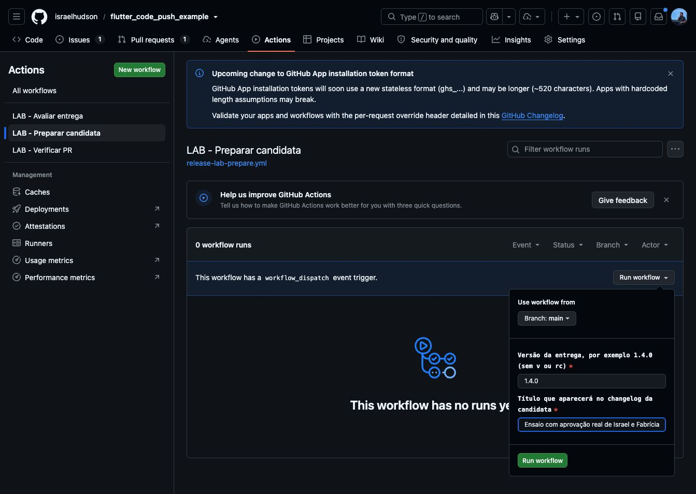
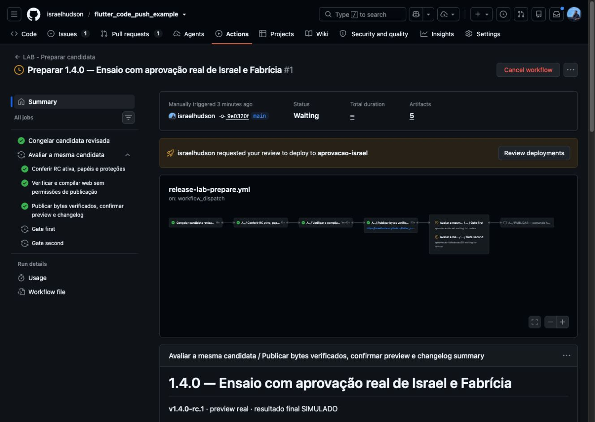
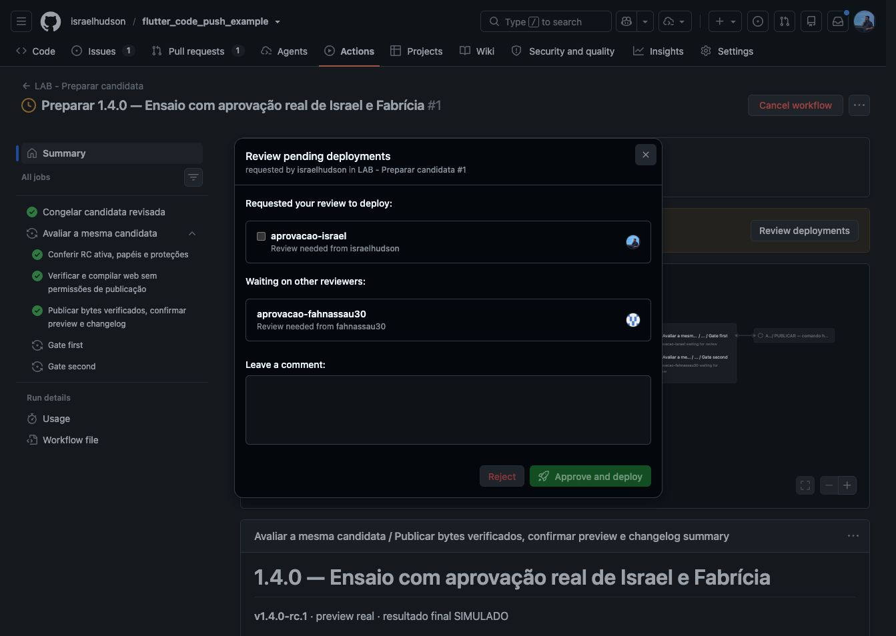

# Ensaio LAB com duas aprovações reais

Registro de 8 de outubro de 2026. Estado observado: **aguardando Israel e Fabrícia**, sem decisões de aprovação registradas. Este documento registra implementação e preparação; não prova a passagem dos gates humanos nem publicação de um app.

## Links do ensaio

- [Candidata e aprovações](https://github.com/israelhudson/flutter_code_push_example/actions/runs/37845381675)
- [Preview da mesma candidata](https://israelhudson.github.io/flutter_code_push_example/snapshots/9e0320fca6fdfba5931d6c80d9181c362ac33c17/)
- [Resumo com changelog e classificação](https://github.com/israelhudson/flutter_code_push_example/actions/runs/37845381675#summary-113545732134)
- [Implementação integrada](https://github.com/israelhudson/flutter_code_push_example/pull/13)
- [Verificação da implementação: 244 testes da esteira, analyze e teste Flutter](https://github.com/israelhudson/flutter_code_push_example/actions/runs/37845043267)

## Como foi preparada

1. No workflow **LAB - Preparar candidata**, foi selecionada a branch `main`, versão `1.4.0` e título **Ensaio com aprovação real de Israel e Fabrícia**.
2. O workflow congelou `v1.4.0-rc.1` na branch `release/1.4.0`, vinculada ao código `9e0320fca6fdfba5931d6c80d9181c362ac33c17`.
3. A candidata passou pelo preflight, analyze, teste Flutter e build web em runner sem permissões de publicação. Outro runner publicou os bytes verificados no Pages, confirmou o preview e congelou o relatório com changelog.
4. Os dois gates ficaram aguardando as respectivas contas. Nenhuma aprovação foi enviada pelo agente.

## Como Fabrícia e Israel aprovam

1. Abrir o link da candidata com a própria conta GitHub.
2. Ler o relatório e verificar o preview e o changelog da candidata.
3. Clicar em **Review deployments**.
4. Fabrícia seleciona **aprovacao-fahnassau30**; Israel seleciona **aprovacao-israel**. Cada pessoa aprova apenas o próprio gate.
5. Depois do sucesso dos dois gates, aparece **autorizar-publicacao**. Israel **ou** Fabrícia pode registrar essa terceira decisão, separada das anteriores.

O terceiro comando gera apenas o recibo simulado do LAB. As decisões são humanas e reais; não há distribuição por Shorebird, lojas ou TestFlight. Android e iOS estão classificados como **Inconclusivo — alvo bloqueado**, porque não há bases de release móvel configuradas.

## Verificação e proteções

- PR integrado após CI verde: 244 testes Python da esteira, analyze e teste Flutter. Os três workflows novos também passaram no actionlint.
- Execução real: congelamento, preflight, testes/build e publicação/relatório concluídos com sucesso; dois gates aguardando.
- Gates exclusivos por identidade, terceiro gate permitindo qualquer um dos dois; sem bypass administrativo.
- Tags novas imutáveis; journal com histórico protegido; `main` e branches de release exigem revisão de PR e CI.
- Uma RC substituída fica bloqueada e a seguinte começa sem reaproveitar aprovações. Reruns e avaliações duplicadas são recusados.
- Workflows antigos preservados fora de `.github/workflows`, sem gatilhos concorrentes ativos.

## Lições para aplicar no Amulets

1. Conservar a separação entre revisão técnica do PR, validação da candidata por duas pessoas e comando final separado. Dois aprovadores no mesmo Environment representam **OU**; dois gates exclusivos representam **E**.
2. Congelar código, política, preview, changelog e relatório na mesma RC. Correções exigem outra RC e novas decisões.
3. Separar build/testes sem credenciais de escrita da publicação em runner novo. Validar os artefatos estáticos antes de dar acesso a Pages.
4. Consultar o histórico real de reviews para obter a identidade de quem decidiu. O ator que disparou a execução não representa os aprovadores.
5. Conferir proteções efetivas, permissões de reviewers e regras de ref antes de permitir a candidata. A disponibilidade desse recurso no LAB público não comprova disponibilidade no repositório privado do Amulets; plano e configuração precisam ser verificados lá.
6. Preservar histórico dos workflows, mas retirar caminhos paralelos de execução. Nesta implementação, a tentativa inicial de desativar gatilhos legados alterando YAML falhou no lint; arquivar os arquivos integralmente resolveu o problema e preservou as fontes.
7. Verificar o HEAD completo antes de integrar. Uma tentativa com SHA esperado incorreto foi recusada pelo GitHub; consultar o HEAD real e usar `--match-head-commit` permitiu a integração correta.
8. Executar a suíte num snapshot coerente. A primeira rodada local encontrou uma fixture sem relatório; a fixture foi corrigida, os 45 testes novos passaram, e a rodada completa no GitHub passou com 244 testes.
9. Usar argumentos estruturados ou quoting para queries de API. Uma consulta local com `?ref=` sem quoting foi interrompida pelo glob do zsh, antes de qualquer alteração remota.
10. Não confundir preview publicado, aprovação real, recibo simulado e distribuição móvel. A prova atual termina no estado aguardando os dois gates. O ensaio completo ainda depende das contas humanas e da terceira decisão.

## Evidências locais

- `run-awaiting-approvals.json`: execução, histórico vazio de reviews e gates pendentes por identidade.
- `state-awaiting-approvals.json`: journal observado depois da geração do relatório.
- `state-observed.json`: observação anterior, durante a avaliação.
- `pr-ci.log`: log da verificação da implementação.
- Diretório vizinho `2026-10-08-two-reviewers-activation`: snapshots de configuração da ativação das proteções.

Avisos de migração de runtime Node de actions foram não bloqueantes nesta execução; devem ser registrados na futura manutenção dos pins. Não houve erro de publicação no Pages nesta candidata.
